# TimeTracking System - Software Architecture Documentation

**Document Version:** 1.0.0
**Last Updated:** 2026-01-15
**Status:** Production-Ready
**Architecture Style:** Cloud-First Microservice Architecture
**Framework:** arc42-inspired structure

---

## Document Control

| Field | Value |
|-------|-------|
| **Project** | TimeTracking System - Enterprise Zeiterfassung |
| **Version** | v1.5.1 |
| **Architects** | Development Team |
| **Reviewers** | Technical Leads |
| **Approval Date** | 2026-01-15 |
| **Next Review** | 2026-04-15 (Quarterly) |

---

## Table of Contents

1. [Introduction & Goals](#1-introduction--goals)
2. [Architecture Constraints](#2-architecture-constraints)
3. [System Context](#3-system-context)
4. [Solution Strategy](#4-solution-strategy)
5. [Building Block View](#5-building-block-view)
6. [Runtime View](#6-runtime-view)
7. [Deployment View](#7-deployment-view)
8. [Cross-Cutting Concepts](#8-cross-cutting-concepts)
9. [Architecture Decisions](#9-architecture-decisions)
10. [Quality Requirements](#10-quality-requirements)
11. [Risks & Technical Debt](#11-risks--technical-debt)
12. [Glossary](#12-glossary)

---

## 1. Introduction & Goals

### 1.1 Requirements Overview

TimeTracking System is a **cloud-based time tracking and absence management solution** for small to medium-sized enterprises (SMEs) in Germany. The system provides:

- Multi-user time tracking (desktop apps)
- Absence management with approval workflows
- Overtime calculation (German labor law compliant)
- Real-time synchronization across all clients
- DSGVO compliance (data stored in Frankfurt)

**Key Differentiator:** Zero-configuration desktop apps with native performance (15 MB vs. 100+ MB Electron apps).

---

### 1.2 Quality Goals

| Priority | Quality Goal | Scenario |
|----------|--------------|----------|
| **1** | **Performance** | API response time <200ms (p95) for 50 concurrent users |
| **2** | **Security** | DSGVO compliance, bcrypt password hashing, HTTPS communication |
| **3** | **Reliability** | 99.5% uptime SLA, automated backups, zero-downtime deployments |
| **4** | **Usability** | Zero IT configuration, auto-connect to cloud server |
| **5** | **Maintainability** | TypeScript strict mode, clear separation of concerns, comprehensive docs |

---

### 1.3 Stakeholders

| Role | Expectations | Concerns |
|------|--------------|----------|
| **End Users (Employees)** | Easy time tracking, transparent overtime | Ease of use, privacy |
| **HR Managers** | Accurate reports, compliance | DSGVO, labor law adherence |
| **System Administrators** | Low maintenance, secure | Reliability, backups, security |
| **Developers** | Clean codebase, good documentation | Code quality, testability |
| **Management** | Cost control, insights | ROI, operational efficiency |

---

## 2. Architecture Constraints

### 2.1 Technical Constraints

| Constraint | Description | Rationale |
|------------|-------------|-----------|
| **SQLite Database** | Limited to ~200 concurrent users | Low infrastructure cost, good enough for SMEs |
| **Single Oracle Cloud Instance** | No horizontal scaling | Free tier limitation |
| **Desktop-Only Clients** | No web browser version | Tauri requires native runtime |
| **German Market Focus** | UI in German, DSGVO compliance | Target audience in Germany |

---

### 2.2 Organizational Constraints

| Constraint | Impact |
|------------|--------|
| **Small Development Team** | 1-2 developers → Simple architecture required |
| **Zero Infrastructure Budget** | Must use Oracle Cloud Free Tier |
| **No DevOps Team** | Fully automated CI/CD required |
| **Compliance Required** | DSGVO, ArbZG, BUrlG compliance mandatory |

---

### 2.3 Conventions

| Area | Convention |
|------|-----------|
| **Code Style** | TypeScript strict mode, ESLint + Prettier enforced |
| **Naming** | PascalCase (Components), camelCase (functions/variables) |
| **Commit Messages** | Conventional Commits (`feat:`, `fix:`, `chore:`) |
| **Branching** | Trunk-based development (main branch) |
| **Documentation** | Markdown files in root + `.claude/` directory |

---

## 3. System Context

### 3.1 Business Context


**External Interfaces:**
- **Desktop App ↔ API Server:** HTTPS REST API + WebSocket
- **API Server → Payroll System:** CSV Export (manual import)

---

### 3.2 Technical Context


**Communication Channels:**
- **Client → Server:** HTTPS (port 443), WSS (port 3000)
- **Server → Database:** Local file I/O (SQLite embedded)
- **Backup → Storage:** Local filesystem (`/backups/`)

---

## 4. Solution Strategy

### 4.1 Architecture Style

**Cloud-First Monolith** (like Slack, Teams)
- **Not:** Traditional Client-Server (local database)
- **Not:** Microservices (too complex for SME)
- **Yes:** Centralized cloud backend + thin desktop clients

**Benefits:**
- Zero configuration for end users
- Real-time synchronization across devices
- Centralized backups and data security
- Easy updates (no manual file distribution)

---

### 4.2 Technology Decisions

#### Frontend: Tauri 2.x (instead of Electron)

**Rationale:**
- 15 MB app size vs. 100+ MB Electron
- Native performance (Rust backend)
- Better security (sandboxed)
- Cross-platform (Windows, macOS, Linux)

**Trade-off:** No web browser version (Tauri requires native runtime)

---

#### Backend: Node.js + Express (instead of alternatives)

**Why Node.js?**
- Fast development (JavaScript ecosystem)
- TypeScript support (type safety)
- Good async I/O performance
- Mature ecosystem (npm packages)

**Alternatives Considered:**
- ❌ Python/Flask: Slower startup time
- ❌ Go: Steeper learning curve
- ❌ Rust: Too complex for rapid development

---

#### Database: SQLite (instead of PostgreSQL/MySQL)

**Why SQLite?**
- Zero configuration (no database server)
- Embedded (runs in process)
- Good enough for <100 users
- Simple backups (single file)

**Trade-offs:**
- Limited concurrency (~200 users max)
- No horizontal scaling
- Must migrate to PostgreSQL if >100 users

**WAL Mode:** Enabled for multi-user write access

---

#### State Management: TanStack Query + Zustand

**Why TanStack Query?**
- Server state caching (reduces API calls)
- Automatic refetching and invalidation
- Optimistic updates
- Error handling built-in

**Why Zustand?**
- Simple UI state management
- No boilerplate (unlike Redux)
- TypeScript-friendly
- Small bundle size (~1 KB)

---

### 4.3 Decomposition Strategy

**Layered Architecture:**

```
┌─────────────────────────────────────┐
│   Presentation Layer (React)        │
│   - Components, Pages, Hooks        │
└──────────────┬──────────────────────┘
               │
┌──────────────▼──────────────────────┐
│   API Layer (REST + WebSocket)      │
│   - Express Routes, Middleware      │
└──────────────┬──────────────────────┘
               │
┌──────────────▼──────────────────────┐
│   Business Logic Layer (Services)   │
│   - timeEntryService, userService   │
└──────────────┬──────────────────────┘
               │
┌──────────────▼──────────────────────┐
│   Data Access Layer (better-sqlite3)│
│   - SQL Queries, Transactions       │
└─────────────────────────────────────┘
```

**Principles:**
- **Separation of Concerns:** Each layer has single responsibility
- **Dependency Rule:** Layers only depend on layers below
- **No Business Logic in Routes:** Controllers are thin, services are thick

---

## 5. Building Block View

### 5.1 Level 0: System Overview (Whitebox)


**Components:**
1. **Desktop App** - Tauri application (Windows/macOS/Linux)
2. **Server** - Node.js backend (Oracle Cloud)
3. **Database** - SQLite database with WAL mode

---

### 5.2 Level 1: Desktop App (Whitebox)


**Components:**

| Component | Responsibility | Technology |
|-----------|----------------|------------|
| **React UI Layer** | Render components, handle user input | React 18, TypeScript |
| **TanStack Query** | Server state caching, automatic refetching | TanStack Query v5 |
| **Zustand Store** | Client state (UI state, modals, theme) | Zustand 4.x |
| **API Client** | HTTP requests, error handling | `universalFetch` wrapper |
| **Tauri Core** | Native APIs, window management | Tauri 2.x (Rust) |

**Key Files:**
- `desktop/src/api/client.ts` - API client configuration
- `desktop/src/lib/tauriHttpClient.ts` - Universal fetch implementation
- `desktop/src/stores/` - Zustand stores
- `desktop/src/hooks/` - TanStack Query hooks

---

### 5.3 Level 1: Server (Whitebox)


**Components:**

| Component | Responsibility | Key Files |
|-----------|----------------|-----------|
| **Express App** | HTTP server, middleware chain | `server/src/server.ts` |
| **Auth Middleware** | Session validation, RBAC | `server/src/middleware/auth.ts` |
| **Route Handlers** | REST API endpoints | `server/src/routes/*.ts` |
| **Services Layer** | Business logic, validations | `server/src/services/*.ts` |
| **Database Layer** | SQL queries, transactions | `server/src/database.ts` |
| **WebSocket Server** | Real-time notifications | `server/src/websocket.ts` |

---

### 5.4 Level 2: Services Layer (Blackbox)

```
services/
├── userService.ts          # User CRUD operations
├── timeEntryService.ts     # Time tracking logic
├── absenceService.ts       # Absence requests & approvals
├── overtimeService.ts      # Overtime calculations
├── vacationBalanceService.ts  # Vacation days tracking
├── authService.ts          # Authentication logic
└── notificationService.ts  # Desktop notifications
```

**Service Pattern:**
```typescript
// Example: timeEntryService.ts
export const timeEntryService = {
  // Create new time entry
  createEntry(data: TimeEntryInput): TimeEntry {
    // 1. Validate input
    validateTimeEntry(data);

    // 2. Check business rules
    checkOverlap(data.userId, data.date);
    checkAbsenceConflict(data.userId, data.date);

    // 3. Calculate hours
    const totalHours = calculateHours(data);

    // 4. Save to database
    return db.insert('time_entries', { ...data, totalHours });
  },

  // Get entries for month
  getEntriesForMonth(userId: number, month: string): TimeEntry[] {
    return db.query('SELECT * FROM time_entries WHERE userId = ? AND date LIKE ?',
      [userId, `${month}%`]);
  },

  // ... other methods
};
```

---

## 6. Runtime View

### 6.1 Scenario: User Login


**Steps:**
1. User enters username + password
2. Desktop app sends POST request to `/api/auth/login`
3. Server queries database for user
4. Server compares password with bcrypt hash
5. Server creates session (express-session)
6. Server sends session cookie (HttpOnly, Secure, SameSite=Strict)
7. Desktop app stores cookie in Tauri's cookie store
8. User redirected to dashboard

**Security:**
- Password never stored in plaintext
- bcrypt cost factor: 10 (balance between security & speed)
- Session cookie: HttpOnly (no JavaScript access), Secure (HTTPS only)

---

### 6.2 Scenario: Create Time Entry


**Key Points:**
- **Double Validation:** Client (instant feedback) + Server (security)
- **Optimistic Updates:** UI updates immediately, rolls back on error
- **Cache Invalidation:** TanStack Query refetches affected queries
- **Real-time Sync:** WebSocket broadcasts to other clients

---

### 6.3 Scenario: Overtime Calculation

**Purpose:** Calculate overtime hours for users based on worked hours, target hours, and absence credits.

**Implementation:** `server/src/utils/workingDays.ts` (493 lines)

---

#### 6.3.1 Calculation Flow


---

#### 6.3.2 Core Formula (IMMUTABLE!)

**This formula follows HR industry standards (Personio, DATEV, SAP):**

```typescript
Überstunden = Ist-Stunden - Soll-Stunden

Where:
  Soll-Stunden (Target) = Arbeitstage × Ziel-Stunden pro Tag
  Ist-Stunden (Actual)  = Gearbeitete Stunden + Abwesenheits-Gutschriften
```

**CRITICAL:** Reference date is ALWAYS **today**, not month end!

---

#### 6.3.3 Calculation Modes

**Mode 1: Standard Weekly Hours**
- User has only `weeklyHours` (e.g., 40)
- Daily target: `weeklyHours / 5 = 8h/day`
- Working days: Monday-Friday (Sa/So excluded)
- Holidays: Always 0h target

**Example:**
```typescript
const user = {
  weeklyHours: 40,
  workSchedule: null,
  hireDate: '2025-02-03', // Monday
};

const targetHours = calculateTargetHoursForPeriod(
  user,
  '2025-02-03', // Mon
  '2025-02-07'  // Fri
);
// Result: 5 days × 8h = 40h
```

**Mode 2: Individual Work Schedule**
- User has `workSchedule` object with hours per day
- Days with `hours > 0` count as working days
- Days with `hours = 0` do NOT count as working days
- Holidays override workSchedule to 0h

**Example:**
```typescript
const user = {
  weeklyHours: 30,
  workSchedule: {
    monday: 8,
    tuesday: 0,      // NOT a working day!
    wednesday: 6,
    thursday: 8,
    friday: 8,
    saturday: 0,
    sunday: 0,
  },
  hireDate: '2025-02-03',
};

const targetHours = calculateTargetHoursForPeriod(
  user,
  '2025-02-03', // Mon
  '2025-02-07'  // Fri
);
// Result: Mo(8) + We(6) + Th(8) + Fr(8) = 30h
// Tuesday excluded (0h day)!
```

---

#### 6.3.4 Absence Credits

**Vacation, Sick Leave, Overtime Compensation:**
- Give credit as if the user worked
- Credit = `targetHoursForDay × days`

**Unpaid Leave:**
- NO credit!
- Reduces target hours instead
- Adjusted Target = Target - (unpaid days × targetHoursPerDay)

**Example (Vacation):**
```typescript
// User: 40h/week (Standard)
// Week: Mon-Tue worked (16h), Wed-Fri vacation (3 days)

const workedHours = 16;
const vacationCredit = 3 × 8 = 24h;
const actualHours = 16 + 24 = 40h;
const targetHours = 5 × 8 = 40h;
const overtime = 40 - 40 = 0h; // ✅ Correct!
```

**Example (Unpaid Leave):**
```typescript
// User: 40h/week (Standard)
// Week: Mon-Wed worked (24h), Thu-Fri unpaid (2 days)

const workedHours = 24;
const unpaidDays = 2;
const targetHours = (5 - 2) × 8 = 24h; // Reduced!
const actualHours = 24; // NO credit for unpaid!
const overtime = 24 - 24 = 0h; // ✅ Correct!
```

---

#### 6.3.5 Critical Edge Cases

**Edge Case #1: Holiday on working day**
- Holiday ALWAYS overrides to 0h target
- Even if workSchedule has hours for that day

**Edge Case #2: Vacation on 0h day**
- If workSchedule[day] = 0h, vacation gives 0h credit
- Example: Vacation on Tuesday (0h day) → 0h credit

**Edge Case #3: Hired mid-week**
- Target hours start from hireDate (inclusive)
- Example: Hired Wednesday → Only Wed-Fri count

**Edge Case #4: Weekend worker**
- If workSchedule has Saturday = 8h → Saturday counts as working day
- Without workSchedule: Sa/So NEVER count

**Edge Case #5: Multiple absences overlapping**
- System prevents overlap during creation
- Validation ensures no double-counting

---

#### 6.3.6 Implementation Functions

**Key Functions in `workingDays.ts`:**

```typescript
// Daily target for a specific date
export function getDailyTargetHours(
  user: UserPublic,
  date: Date | string
): number

// Target hours for a period
export function calculateTargetHoursForPeriod(
  user: UserPublic,
  startDate: string,
  endDate: string
): number

// Working days count (excludes weekends & holidays)
export function countWorkingDaysBetween(
  from: Date,
  to: Date,
  holidays: string[]
): number

// Absence credit with workSchedule
export function calculateAbsenceHoursWithWorkSchedule(
  startDate: string,
  endDate: string,
  workSchedule: Record<DayName, number>,
  weeklyHours: number
): number

// Working days per week (respects workSchedule)
export function calculateWorkingDaysPerWeek(
  workSchedule: Record<DayName, number> | null,
  weeklyHours: number
): number
```

---

#### 6.3.7 Testing Strategy

**Test Coverage:** 73% (Target: 80%)

**Test Files:**
- `server/src/utils/workingDays.test.ts` (1004 lines, 32 test cases)
- `docs/OVERTIME_TESTING_GUIDE.md` (Quick Reference, 900 lines)

**Test Scenarios:**
1. Standard 40h week (no absences)
2. Individual work schedule with 0h days
3. Vacation week (credit validation)
4. Sick leave month (credit validation)
5. Unpaid leave (target reduction)
6. Holiday-heavy month (December)
7. Weekend worker (Saturday as working day)
8. Vacation on 0h day (no credit)
9. Partial week (hired mid-week)
10. Overtime compensation (credit validation)

**Validation Script:**
```bash
# Validate single user
npm run validate:overtime -- --userId=5

# Validate all users
npm run validate:overtime -- --all

# Validate with expected value
npm run validate:overtime -- --userId=5 --expected="+37:30"

# Validate test scenario
npm run validate:overtime -- --scenario=hans-individual-schedule
```

**Tools:**
- `server/src/test/generateTestData.ts` - Test scenario generator (10 predefined scenarios)
- `server/src/scripts/validateOvertimeCalculation.ts` - On-demand validation script

---

#### 6.3.8 Production Monitoring

**Performance:**
- Calculation time: <50ms per user (tested with 42 users)
- Database queries: 4 per user (users, time_entries, absences, holidays)
- No caching (always on-demand calculation for accuracy)

**Data Integrity:**
- Audit log tracks all overtime changes
- Work time accounts table (`work_time_accounts`) stores balance history
- Quarterly audits recommended (use validation script)

**Known Limitations:**
- No caching due to real-time requirement
- Calculation complexity: O(n) where n = days since hire date
- For >1000 users: Consider async calculation + caching

---

**Reference:** See [OVERTIME_TESTING_GUIDE.md](docs/OVERTIME_TESTING_GUIDE.md) for detailed validation procedures

---

#### 6.3.9 Reports Page - Single Source of Truth Implementation ✅

**STATUS (2026-01-24):** ✅ **RESOLVED** - Berichte-Tab now uses Single Source of Truth

**Previous Issue:** Massive discrepancy between components (+57:30h vs -14:30h)
- "Überstunden-Transaktionen" used `overtime_transactions` table (✅ correct)
- "Monatliche Entwicklung" used `overtime_balance` via `reportService` (❌ wrong - outdated)
- Two different data sources = user confusion

**Fix:** Complete migration to transaction-based system
1. ✅ New endpoint: `/api/overtime/transactions/monthly-summary`
2. ✅ New service: `getMonthlyTransactionSummary()` in `overtimeTransactionService.ts`
3. ✅ New hook: `useOvertimeHistoryFromTransactions()`
4. ✅ Updated `WorkTimeAccountHistory.tsx` to use transaction data
5. ✅ Added "Korrektur" column for transparency

**Result:** Both components now show SAME balance (professional standard: SAP SuccessFactors, Personio)

---

##### 6.3.9.1 NEW Architecture (Transaction-Based) ✅

```mermaid
graph TD
    A[User creates time_entry] --> B[timeEntryService.ts]
    B --> C[overtimeService.ts]
    C --> D[updateOvertimeTransactionsForDate]
    D --> E[overtime_transactions table]

    E --> F[Berichte-Tab Components]
    F --> G[OvertimeTransactions.tsx]
    F --> H[WorkTimeAccountHistory.tsx]

    G --> I[Shows: Individual Transactions]
    H --> J[Shows: Monthly Summary]

    I --> K[Zeitkonto-Saldo: -14:30h ✅]
    J --> K

    style E fill:#90EE90
    style K fill:#90EE90
```



**Benefits:**
- ✅ Dual System: `overtime_balance` (aggregated balance) + `overtime_transactions` (audit trail)
- ✅ Balance calculation: Uses `overtime_balance` table (includes unpaid leave reduction)
- ✅ Guaranteed consistency (both widgets show same balance)
- ✅ Full transparency (earned/compensation/correction breakdown in transactions)
- ✅ Professional standard (SAP/Personio compliance)
- ✅ Immutable audit trail (all changes tracked)

---

##### 6.3.9.2 Transaction Service (Audit Trail + Balance Calculation) ✅

**File:** `server/src/services/overtimeTransactionService.ts` (~478 lines)

**Purpose:** Professional transaction-based overtime tracking (SAP SuccessFactors standard)

**Transaction Types:**
- `earned`: Daily overtime from time entries (Soll/Ist difference)
- `compensation`: Overtime deduction when taking time off
- `correction`: Manual adjustments by admin
- `carryover`: Year-end transfer markers (audit trail only)

**Key Functions:**

1. **`getMonthlyTransactionSummary(userId, months)`** (Line 399-477)
   - Groups transactions by month
   - Calculates cumulative balance (bank account style)
   - Returns: `{ month, earned, compensation, correction, carryover, balance, balanceChange }`
   - Used by: Berichte-Tab "Monatliche Entwicklung"

2. **`getOvertimeBalance(userId)`** (Line 363-374) ✅ FIXED 2026-01-25
   - Current overtime balance from `overtime_balance` table (Single Source of Truth)
   - Query: `SUM(actualHours - targetHours) FROM overtime_balance`
   - **NOT** from transactions! (`overtime_balance` includes unpaid leave reduction)
   - Used by: "Zeitkonto-Saldo" display in Überstunden-Transaktionen widget

3. **`recordOvertimeEarned(userId, date, hours)`** (Line 44-68)
   - Called automatically after time entry changes
   - Immutable audit trail

**Database:**
```sql
overtime_transactions (id, userId, date, type, hours, description, referenceType, referenceId, createdAt, createdBy)
```

**Benefits:**
- ✅ Immutable audit trail (all changes tracked)
- ✅ Transaction breakdown visible to user
- ✅ Professional standard (SAP, Personio, DATEV)
- ✅ No recalculation needed (read from DB)

---

##### 6.3.9.3 API Endpoints (NEW) ✅

**File:** `server/src/routes/overtime.ts`

**Endpoint 1: Monthly Summary**
```
GET /api/overtime/transactions/monthly-summary?userId={id}&months={1-36}
```
**Response:**
```json
{
  "success": true,
  "data": {
    "summary": [
      {
        "month": "2026-01",
        "earned": -14.5,
        "compensation": 0,
        "correction": 0,
        "carryover": 0,
        "balance": -14.5,
        "balanceChange": -14.5
      }
    ],
    "currentBalance": -14.5,
    "userId": 155
  }
}
```

**Used by:** `WorkTimeAccountHistory.tsx` (Monatliche Entwicklung)

**Endpoint 2: Individual Transactions**
```
GET /api/overtime/transactions/:userId?year={year}&limit={n}
```
**Used by:** `OvertimeTransactions.tsx` (Überstunden-Transaktionen)

---

##### 6.3.9.4 Frontend Hooks (NEW) ✅

**File:** `desktop/src/hooks/useOvertimeReports.ts`

**Hook:** `useOvertimeHistoryFromTransactions(userId, months)`
```typescript
export function useOvertimeHistoryFromTransactions(userId: number, months: number = 12) {
  return useQuery({
    queryKey: ['overtime-history-transactions', userId, months],
    queryFn: async (): Promise<OvertimeHistoryEntry[]> => {
      const response = await apiClient.get(`/overtime/transactions/monthly-summary?userId=${userId}&months=${months}`);
      return response.data.summary;
    },
    enabled: !!userId,
  });
}
```

**Replaces:** `useOvertimeHistory()` (deprecated - used `overtime_balance` which was outdated)

**Used by:**
- `WorkTimeAccountHistory.tsx` (Line 15)

---

##### 6.3.9.5 Updated Components ✅

**File:** `desktop/src/components/worktime/WorkTimeAccountHistory.tsx`

**Changes:**
1. ✅ Switched to `useOvertimeHistoryFromTransactions()` (Line 15)
2. ✅ Added "Korrektur" column to table (Line 109-216)
3. ✅ Enhanced summary section with correction totals (Line 301-313)
4. ✅ Color coding: green/red (earned), orange (compensation), purple (correction)
5. ✅ Conditional carryover column (only shown when needed)

**Result:** Now matches "Zeitkonto-Saldo" in OvertimeTransactions component (no more discrepancy!)

---

##### 6.3.9.6 Overtime System Architecture (Updated 2026-01-27) ✅

**Current State:** Simplified hybrid system with performance optimizations

**Active Components:**
- ✅ `overtime_balance` table (monthly aggregates - Single Source of Truth for reports)
- ✅ `overtime_transactions` table (immutable audit trail)
- ✅ `reportService.ts` (reads from `overtime_balance`, no longer recalculates)
- ✅ `/api/reports/overtime/user/:userId` endpoint
- ✅ `overtimeService.ts` - Optimized update chain

**Removed/Deprecated (2026-01-27):**
- ❌ `overtime_daily` table - No longer used by application (tables exist for backward compatibility)
- ❌ `overtime_weekly` table - No longer used by application (tables exist for backward compatibility)
- ❌ `updateDailyOvertime()` - Removed from runtime
- ❌ `updateWeeklyOvertime()` - Removed from runtime
- ❌ 6 deprecated API endpoints (daily/weekly overtime)

**Performance Improvements:**
- Before: 3 table updates per time entry (daily + weekly + monthly)
- After: 1 table update per time entry (monthly only)
- Result: ~66% reduction in database writes

**System Behavior:**
- Time entry created/updated → `updateAllOvertimeLevels()` called
- Updates `overtime_transactions` (audit trail)
- Updates `overtime_balance` (monthly SSOT)
- Skips daily/weekly tables (deprecated)
- Syncs `work_time_accounts` table

**Known Issues (Remaining):**
1. ⚠️ Timezone bug in weekly aggregation (reportService.ts Line 245) - Low priority (weekly no longer used)
2. ✅ Fixed: Dual calculation paths eliminated

**Future Work:**
- Optional: Remove `overtime_daily` and `overtime_weekly` tables via database migration
- Currently kept for backward compatibility with any external scripts/tools

---

##### 6.3.9.6 Frontend Hooks & Components

**Hook:** `useOvertimeReport()` (Line 52-67 in `useOvertimeReports.ts`)
```typescript
export function useOvertimeReport(userId: number, year: number, month?: number) {
  return useQuery({
    queryKey: ['overtime-report', userId, year, month],
    queryFn: async () => {
      const response = await apiClient.get(`/reports/overtime/user/${userId}?${params}`);
      // ❌ Uses reportService (recalculates!)
      return response.data;
    },
  });
}
```

**Used By (Affected Components):**
- `TeamOvertimeSummary.tsx` (Admin Dashboard) - Calls `useAllUsersOvertimeReports()`
  - ❌ Fetches report for EVERY user → recalculates for each!
  - Performance issue: O(n) API calls + recalculations
- `BalanceSummaryWidget.tsx` (Employee Dashboard) - Uses `useOvertimeYearBreakdown()` ✅

---

##### 6.3.9.7 Recommended Fix (PROFESSIONAL!)

**Option A: Single Source of Truth (BEST PRACTICE)**

Refactor `reportService.ts` to READ from database instead of recalculating:

```typescript
export async function getUserOvertimeReport(userId, year, month?) {
  // ❌ REMOVE: calculateDailyBreakdown() → Own calculation
  // ✅ ADD: Read from overtime_balance table!

  const monthFilter = month
    ? `${year}-${String(month).padStart(2,'0')}`
    : `${year}-%`;

  const monthlyData = db.prepare(`
    SELECT month, targetHours, actualHours, overtime
    FROM overtime_balance
    WHERE userId = ? AND month LIKE ?
    ORDER BY month
  `).all(userId, monthFilter);

  // Calculate summary from DB data
  const summary = {
    targetHours: monthlyData.reduce((sum, m) => sum + m.targetHours, 0),
    actualHours: monthlyData.reduce((sum, m) => sum + m.actualHours, 0),
    overtime: monthlyData.reduce((sum, m) => sum + m.overtime, 0),
  };

  return { userId, year, month, summary, breakdown: { monthly: monthlyData } };
}
```

**Benefits:**
- ✅ Single Source of Truth (overtime_balance)
- ✅ No discrepancies
- ✅ Faster (no recalculation)
- ✅ Professional (SAP, Personio, DATEV do this)

**Option B: Align Frontend with Backend (QUICK FIX)**

Keep dual system but ensure both calculate IDENTICALLY:
1. Fix timezone bug in Line 245
2. Ensure unpaid leave logic matches backend
3. Add extensive tests comparing both systems

---

##### 6.3.9.8 Testing & Validation

**Validation Script:**
```bash
# Compare backend DB vs frontend API for all months
npm run validate:overtime:detailed -- --userId=155 --month=2025-12 --compare

# Output shows:
# - Backend (overtime_balance): 156h target
# - Frontend (reportService):   162h target
# - Discrepancy: +6h ❌
```

**Test Users with Known Issues:**
- User 155 (Test Workflow): 6h discrepancy in Dec 2025
- User 3 (Christine Glas): 6h discrepancy in Jan 2026 (Heilige Drei Könige)

---

##### 6.3.9.9 Migration Path

**Phase 1: Analysis (DONE ✅)**
- Document dual system problem
- Identify all discrepancies
- Test timezone fix

**Phase 2: Decision (NEXT)**
- Choose Option A (recommended) or Option B
- Get stakeholder approval

**Phase 3: Implementation**
- Refactor reportService.ts
- Update API endpoint
- Update frontend hooks

**Phase 4: Validation**
- Run comparison tests for all users
- Verify no regressions
- Update documentation

**Phase 5: Cleanup**
- Remove duplicate calculation code
- Archive legacy endpoints
- Update deployment docs

---

**Status:** ⚠️ TECHNICAL DEBT - Requires immediate attention
**Priority:** HIGH (data integrity issue)

---

#### 6.3.10 Unified Overtime Architecture (v1.6.0 - In Development)

**STATUS:** 🔄 Migration in Progress (Week 06-10/2026)

**Purpose:** Eliminate dual calculation system by consolidating all overtime logic into single service

**Architecture Decision:** Based on ADR-006, implementing UnifiedOvertimeService as SSOT


**Implementation Components:**

1. **UnifiedOvertimeService** (NEW)
   - Location: `server/src/services/unifiedOvertimeService.ts`
   - Single calculation engine for all overtime logic
   - Methods:
     - `calculateDailyOvertime(userId, date)`
     - `calculateMonthlyOvertime(userId, month)`
     - `calculatePeriodOvertime(userId, startDate, endDate)`
   - All other services MUST delegate to this service

2. **Migration Strategy:**
   ```typescript
   // Step 1: Parallel validation (v1.5.3)
   const oldResult = reportService.calculateDailyBreakdown(userId, date);
   const newResult = unifiedOvertimeService.calculateDailyOvertime(userId, date);
   if (oldResult !== newResult) {
     logger.warn('Calculation mismatch', { oldResult, newResult });
   }

   // Step 2: Feature flag rollout (v1.5.4)
   if (featureFlags.useUnifiedOvertimeService) {
     return unifiedOvertimeService.calculateDailyOvertime(userId, date);
   }

   // Step 3: Full migration (v1.6.0)
   // Remove old calculation paths
   ```

3. **Data Flow (v1.6.0):**
   - ALL overtime calculations → UnifiedOvertimeService
   - UnifiedOvertimeService → writes to overtime_balance (aggregated)
   - UnifiedOvertimeService → writes to overtime_transactions (audit)
   - Frontend components → read from overtime_balance via API
   - No service performs independent calculations

4. **Benefits:**
   - ✅ Zero calculation discrepancies
   - ✅ 60% less code duplication
   - ✅ Single test suite for all overtime logic
   - ✅ Easier compliance audits
   - ✅ Professional standard (SAP, Personio pattern)

**Migration Timeline:**
- Week 06 (2026): Design & tests
- Week 07: Implement UnifiedOvertimeService
- Week 08: Parallel validation in staging
- Week 09: Feature flag rollout
- Week 10: Full production migration
**Owner:** Development Team
**Target:** Q1 2026

---

## 7. Deployment View

### 7.1 Infrastructure Overview - 3-Tier Environment

**Updated:** 2026-02-10 - Professional Development Workflow

```mermaid
graph TB
    subgraph "End Users"
        A1[Windows Desktop]
        A2[macOS Desktop]
        A3[Linux Desktop]
    end

    subgraph "Development Environment"
        DEV1[localhost:3000]
        DEV2[development.db]
        DEV3[Small Test Dataset]
    end

    subgraph "Oracle Cloud - Staging Green Server"
        STG1[Port 3001]
        STG2[database-staging.db]
        STG3[Production Snapshot - Separate File]
        STG4[Manual Sync from Prod]
    end

    subgraph "Oracle Cloud - Production Blue Server"
        PROD1[Port 3000]
        PROD2[database-shared.db via symlink]
        PROD3[Live Customer Data]
        PROD4[Backup Storage]
    end

    A1 -->|Development| DEV1
    A2 -->|Development| DEV1
    A3 -->|Development| DEV1

    A1 -->|Staging Testing| STG1
    A2 -->|Staging Testing| STG1
    A3 -->|Staging Testing| STG1

    A1 -->|Production| PROD1
    A2 -->|Production| PROD1
    A3 -->|Production| PROD1

    DEV1 --> DEV2
    DEV2 --> DEV3

    STG1 --> STG2
    STG2 --> STG3
    PROD2 -.->|Manual Sync (/sync-green)| STG2

    PROD1 --> PROD2
    PROD2 --> PROD3
    PROD3 --> PROD4
```

**Environment Flow:**
```
Development (Local)  →  Staging (Green:3001)  →  Production (Blue:3000)
  development.db         database-staging.db        database-shared.db (symlink)
  Small dataset          Prod snapshot (manual sync) Live customer data
  Fast iteration         Pre-prod testing           Zero downtime
```

**Database Architecture Notes:**
- **Blue Server (Production):** Uses symlink `server/database.db` → `/home/ubuntu/database-shared.db`
- **Green Server (Staging):** Uses separate file `/home/ubuntu/database-staging.db`
- **Sync Strategy:** Manual on-demand via `/sync-green` command (not automatic)
- **Why Manual?** Allows controlled testing without unexpected production data changes

---

### 7.2 Oracle Cloud Configuration

**Instance Details:**
- **Type:** VM.Standard.E2.1.Micro (Always Free Tier)
- **CPU:** 1 OCPU (2 vCPUs)
- **RAM:** 1 GB
- **Storage:** 50 GB Block Volume
- **OS:** Ubuntu 22.04 LTS
- **Region:** eu-frankfurt-1 (Germany - DSGVO compliant)
- **Public IP:** 129.159.8.19 (static)

**Network Configuration:**
- **VCN:** Default Virtual Cloud Network
- **Subnet:** Public subnet (0.0.0.0/0 internet access)
- **Security List:**
  - Ingress: Port 22 (SSH), Port 3000 (Production), Port 3001 (Staging)
  - Egress: All protocols, all ports (0.0.0.0/0)

**Firewall (UFW):**
```bash
ufw allow 22/tcp    # SSH
ufw allow 3000/tcp  # Production API Server (Blue)
ufw allow 3001/tcp  # Staging API Server (Green)
ufw enable
```

**Server Directories:**
```bash
/home/ubuntu/
├── database-shared.db           # Production Database (accessed via symlink)
├── database-staging.db          # Staging Database (separate file)
├── TimeTracking-Clean/          # Production (Blue Server)
│   ├── server/
│   │   └── database.db → /home/ubuntu/database-shared.db (symlink)
│   └── ...
├── TimeTracking-Staging/        # Staging (Green Server)
│   ├── server/
│   │   └── (uses DATABASE_PATH env var → /home/ubuntu/database-staging.db)
│   └── ...
├── backups/                     # DB Backups
│   ├── database-shared.backup.*.db
│   ├── database-staging.backup.*.db
│   └── database-staging.db.backup-* (manual sync backups)
└── logs/
    └── pm2-*.log               # PM2 process logs
```

**Database Setup Explanation:**
- **Blue Server:** Symlink approach for easy backup management
- **Green Server:** Separate file allows independent testing
- **Manual Sync:** `/sync-green` creates timestamped backups before overwriting

**PM2 Processes:**
```bash
pm2 list
┌─────┬────────────────────────┬─────────┬──────┐
│ id  │ name                   │ status  │ port │
├─────┼────────────────────────┼─────────┼──────┤
│ 7   │ timetracking-server    │ online  │ 3000 │ ← Production (Blue)
│ 8   │ timetracking-staging   │ online  │ 3001 │ ← Staging (Green)
└─────┴────────────────────────┴─────────┴──────┘
```

---

### 7.3 Green Server (Staging) Architecture

**Purpose:** Pre-production testing environment with production data snapshot

**URL:** http://129.159.8.19:3001
**Database:** `/home/ubuntu/database-staging.db` (492KB, synced from Blue)
**PM2 Process:** `timetracking-staging`
**Git Branch:** `staging`
**Code Location:** `/home/ubuntu/TimeTracking-Staging/`

**3-Tier Environment System:**
```
Development (localhost:3000)
    ↓ git push origin staging
Staging (Green Server Port 3001)
    ↓ /promote-to-prod
Production (Blue Server Port 3000)
```

**Critical Differences vs Blue Server:**

| Aspect | Blue Server (Production) | Green Server (Staging) |
|--------|--------------------------|------------------------|
| **Port** | 3000 | 3001 |
| **Database** | `/home/ubuntu/database-shared.db` (symlink) | `/home/ubuntu/database-staging.db` (separate file) |
| **NODE_ENV** | `production` | `staging` |
| **DATABASE_PATH** | Not needed (symlink works) | **REQUIRED!** `/home/ubuntu/database-staging.db` |
| **Data Source** | Live customer data | Production snapshot (manual sync via `/sync-green`) |
| **Auto-Deploy** | On push to `main` branch | On push to `staging` branch |
| **Deployment Command** | `/promote-to-prod` | Automatic (GitHub Actions) |

**Environment Variables (CRITICAL!):**
```bash
TZ=Europe/Berlin                              # German timezone
NODE_ENV=staging                              # Staging environment
DATABASE_PATH=/home/ubuntu/database-staging.db  # CRITICAL! Must be explicitly set
PORT=3001                                     # Staging port
SESSION_SECRET=<random-secret>                # Separate from Blue Server
```

**Why DATABASE_PATH is required:**
- `getDatabasePath()` function in `server/src/config/database.ts` checks `NODE_ENV`
- `NODE_ENV=staging` is NOT `production` → defaults to `development.db` ❌
- Without explicit `DATABASE_PATH`: Server loads wrong database
- Symptom: 500 Errors "no such column: position" (old DB without migrations)
- **Fix (2026-02-11):** Patch `getDatabasePath()` to check `process.env.DATABASE_PATH` first

**PM2 Start Command (Template):**
```bash
TZ=Europe/Berlin NODE_ENV=staging DATABASE_PATH=/home/ubuntu/database-staging.db PORT=3001 SESSION_SECRET=$SECRET \
  pm2 start dist/server.js \
  --name timetracking-staging \
  --cwd /home/ubuntu/TimeTracking-Staging/server \
  --time \
  --update-env

pm2 save
```

**Database Sync Strategy:**
```bash
# Manual sync from Blue → Green (on-demand)
/sync-green

# What happens:
# 1. Backup Green DB: database-staging.db.backup-<timestamp>
# 2. Copy Blue DB → Green DB: cp database-shared.db database-staging.db
# 3. Restart Green Server: pm2 restart timetracking-staging
# 4. Health Check + Schema Verification
```

**Debugging Checklist:**
```bash
# 1. PM2 Status
pm2 list
# Expected: timetracking-staging = "online" (not "errored")

# 2. Which Database?
PM2_PID=$(pgrep -f 'timetracking-staging' | head -1)
lsof -p $PM2_PID | grep '.db'
# Expected: /home/ubuntu/database-staging.db (NOT development.db!)

# 3. Environment Variables
pm2 env <ID> | grep -E '(DATABASE_PATH|NODE_ENV|PORT)'
# Expected: DATABASE_PATH=/home/ubuntu/database-staging.db

# 4. Logs
pm2 logs timetracking-staging --lines 20
# Expected: "env":"staging", "Listening on http://0.0.0.0:3001"

# 5. Health Check
curl http://localhost:3001/api/health
# Expected: {"status":"ok", ...}
```

**Common Issues:**
- **500 Errors:** Wrong database loaded (development.db) → Set `DATABASE_PATH`
- **Port Conflict:** Server tries port 3000 → Set `PORT=3001`
- **Crash Loop:** Check `pm2 logs timetracking-staging --err`

---

### 7.4 Server Software Stack

**Operating System Layer:**
```
Ubuntu 22.04 LTS
├── System Updates (unattended-upgrades)
├── SSH Server (OpenSSH 8.9)
└── UFW Firewall
```

**Application Layer:**
```
Node.js 20.19.5 LTS (via NodeSource PPA)
├── PM2 5.x (Process Manager)
├── Express 4.x (Web Framework)
├── better-sqlite3 9.x (Database Driver)
└── ws 8.x (WebSocket Server)
```

**Runtime Configuration:**
```bash
# PM2 Ecosystem (ecosystem.config.js)
{
  name: 'timetracking-server',
  script: './dist/server.js',
  instances: 1,
  exec_mode: 'cluster',
  env: {
    NODE_ENV: 'production',
    TZ: 'Europe/Berlin',  # CRITICAL for date calculations!
    PORT: 3000
  }
}
```

---

### 7.5 CI/CD Pipeline (GitHub Actions) - Dual Deployment

**Updated:** 2026-02-10 - Separate Pipelines for Staging & Production


#### 7.4.1 Production Deployment (Blue Server)

**Workflow File:** `.github/workflows/deploy-server.yml`

**Trigger:** Push to `main` branch (only if `server/**` changed)

**Steps:**
1. **Type Check:** `npx tsc --noEmit` (fail fast on TypeScript errors)
2. **Security Audit:** `npm audit --audit-level=high` (check dependencies)
3. **SSH Connection:** Connect to Oracle Cloud (SSH key from GitHub Secrets)
4. **Database Backup:** Run backup script before deployment
5. **Navigate:** `cd /home/ubuntu/TimeTracking-Clean/server`
6. **Install & Build:** `npm ci && npm run build`
7. **PM2 Reload:** `pm2 reload timetracking-server` (zero-downtime)
8. **Health Check:** `curl http://localhost:3000/api/health`

**Deployment Time:** ~2-3 minutes

**Target:**
- Directory: `/home/ubuntu/TimeTracking-Clean`
- PM2 Process: `timetracking-server`
- Port: 3000
- Database: `/home/ubuntu/database-shared.db` (accessed via symlink: `server/database.db` → `/home/ubuntu/database-shared.db`)

#### 7.4.2 Staging Deployment (Green Server)

**Workflow File:** `.github/workflows/deploy-staging.yml`

**Trigger:** Push to `staging` branch (only if `server/**` changed)

**Steps:**
1. **Type Check:** `npx tsc --noEmit`
2. **Security Audit:** `npm audit --audit-level=high`
3. **SSH Connection:** Connect to Oracle Cloud
4. **Database Backup:** Backup staging.db before deployment
5. **Navigate:** `cd /home/ubuntu/TimeTracking-Staging/server`
6. **Install & Build:** `npm ci && npm run build`
7. **PM2 Reload:** `pm2 reload timetracking-staging` (zero-downtime)
8. **Health Check:** `curl http://localhost:3001/api/health`

**Deployment Time:** ~2-3 minutes

**Target:**
- Directory: `/home/ubuntu/TimeTracking-Staging`
- PM2 Process: `timetracking-staging`
- Port: 3001
- Database: `/home/ubuntu/database-staging.db`

**Environment Variables:**
```bash
NODE_ENV=staging
PORT=3001
TZ=Europe/Berlin
SESSION_SECRET=<secure-random>
DATABASE_PATH=/home/ubuntu/database-staging.db
```

#### 7.4.3 Git Workflow Strategy

```
feature/xyz      →     staging         →        main
   ↓                      ↓                       ↓
Development          Green :3001             Blue :3000
localhost:3000     database-staging.db    database-shared.db
(small dataset)   (manual prod sync)    (live customer data)
```

**Development Cycle:**
1. Create feature branch from `main`
2. Develop locally with development.db
3. Merge to `staging` branch → Auto-deploy to Green Server
4. Test with Desktop App: `/green && npm run dev` (slash command)
5. Verify with real production data (database-staging.db)
6. If needed: `/sync-green` to update staging DB with latest production data
7. If OK: Merge `staging` to `main` → Auto-deploy to Blue Server
8. Production health check + user testing

**Benefits:**
- Bugs caught with real data before production
- Migrations tested on production snapshot
- Zero customer impact during testing
- Professional workflow matching industry standards

---

### 7.5 Desktop App Distribution

**Build Pipeline:** `.github/workflows/release.yml`

**Trigger:** Git tag push (`v*.*.*`)

**Parallel Builds (4 runners):**
```
┌─────────────┐  ┌─────────────┐  ┌─────────────┐  ┌─────────────┐
│  Windows    │  │  macOS      │  │  macOS      │  │  Linux      │
│  x86_64     │  │  x86_64     │  │  aarch64    │  │  x86_64     │
│             │  │  (Intel)    │  │  (M1/M2)    │  │             │
│  → .msi     │  │  → .dmg     │  │  → .dmg     │  │  → .AppImage│
│             │  │             │  │             │  │  → .deb     │
└─────────────┘  └─────────────┘  └─────────────┘  └─────────────┘
       │                │                 │                 │
       └────────────────┼─────────────────┼─────────────────┘
                        │
                        ▼
              Upload to GitHub Release
                        │
                        ▼
              Generate latest.json (Auto-Update Manifest)
```

**Output:**
- Windows: `.msi` installer
- macOS: `.dmg` Universal binary (Intel + ARM)
- Linux: `.AppImage` + `.deb` package

**Signing:**
- Binaries signed with Ed25519 key (minisign)
- Public key embedded in app for auto-update verification

**Build Time:** ~8-12 minutes (parallel builds)

---

### 7.6 Backup Strategy

**Automated Backups:**
- **Script:** `scripts/database/backup.sh`
- **Schedule:** Daily at 2 AM (systemd timer or cron)
- **Method:** SQLite Online Backup API (safe during operation)

**GFS Rotation:**
```
/home/ubuntu/TimeTracking-Clean/backups/
├── daily/
│   ├── database_daily_20260115_020000.db  (keep 7 days)
│   ├── database_daily_20260114_020000.db
│   └── ...
├── weekly/
│   ├── database_week02_2026.db  (keep 4 weeks)
│   ├── database_week01_2026.db
│   └── ...
└── monthly/
    ├── database_2026-01.db  (keep 12 months)
    ├── database_2025-12.db
    └── ...
```

**Backup Verification:**
- Integrity check after each backup: `PRAGMA integrity_check`
- Test restore monthly on development environment

**Off-Site Backup:**
- Manual download via `scripts/production/backup-db.sh`
- Encrypted with GPG (future enhancement)

---

## 8. Cross-Cutting Concepts

### 8.1 Security Concepts

#### Authentication
```typescript
// Password Hashing (bcrypt cost factor 10)
const hashedPassword = await bcrypt.hash(password, 10);

// Session Management (express-session)
app.use(session({
  secret: process.env.SESSION_SECRET, // 256-bit random string
  resave: false,
  saveUninitialized: false,
  cookie: {
    httpOnly: true,      // No JavaScript access
    secure: true,        // HTTPS only
    sameSite: 'strict',  // CSRF protection
    maxAge: 86400000     // 24 hours
  }
}));
```

#### Authorization (RBAC)
```typescript
// Middleware
function requireAuth(req, res, next) {
  if (!req.session.userId) {
    return res.status(401).json({ error: 'Unauthorized' });
  }
  next();
}

function requireAdmin(req, res, next) {
  if (req.session.role !== 'admin') {
    return res.status(403).json({ error: 'Forbidden' });
  }
  next();
}

// Usage
app.get('/api/users', requireAuth, requireAdmin, (req, res) => {
  // Only admins can access
});
```

#### Input Validation
```typescript
// Client-side (React)
const schema = z.object({
  date: z.string().regex(/^\d{4}-\d{2}-\d{2}$/),
  startTime: z.string().regex(/^\d{2}:\d{2}$/),
  endTime: z.string().regex(/^\d{2}:\d{2}$/),
});

// Server-side (Express)
app.post('/api/time-entries', (req, res) => {
  // Re-validate (never trust client)
  if (!validateDateString(req.body.date)) {
    return res.status(400).json({ error: 'Invalid date' });
  }
  // ...
});
```

---

### 8.2 Database Access Pattern

**Prepared Statements (SQL Injection Prevention):**
```typescript
// ✅ CORRECT - Uses placeholders
const user = db.prepare('SELECT * FROM users WHERE id = ?').get(userId);

// ❌ WRONG - String concatenation (vulnerable!)
const user = db.prepare(`SELECT * FROM users WHERE id = ${userId}`).get();
```

**Transaction Management:**
```typescript
const transaction = db.transaction((data) => {
  // 1. Create absence request
  const absence = db.prepare('INSERT INTO absence_requests ...').run(data);

  // 2. Update vacation balance
  db.prepare('UPDATE vacation_balance SET usedDays = usedDays + ?').run(data.days);

  // 3. Create notification
  db.prepare('INSERT INTO notifications ...').run({ userId: data.userId });

  return absence;
});

// Execute transaction (all-or-nothing)
const result = transaction(absenceData);
```

**Soft Delete Pattern:**
```typescript
// ✅ CORRECT - Soft delete (sets deletedAt timestamp)
db.prepare('UPDATE users SET deletedAt = datetime("now") WHERE id = ?').run(userId);

// ❌ WRONG - Hard delete (permanent data loss)
db.prepare('DELETE FROM users WHERE id = ?').run(userId);
```

---

### 8.3 Error Handling

**Backend:**
```typescript
app.post('/api/time-entries', async (req, res) => {
  try {
    // Validation
    if (!req.body.date) {
      return res.status(400).json({ error: 'Date required' });
    }

    // Business logic
    const entry = timeEntryService.createEntry(req.body);

    // Success response
    return res.status(201).json({ success: true, data: entry });
  } catch (error) {
    console.error('Error creating time entry:', error);
    return res.status(500).json({ error: 'Internal server error' });
  }
});
```

**Frontend (TanStack Query):**
```typescript
const mutation = useMutation({
  mutationFn: (data) => apiClient.post('/time-entries', data),
  onSuccess: () => {
    toast.success('Time entry created');
    queryClient.invalidateQueries(['time-entries']);
  },
  onError: (error) => {
    toast.error(error.message || 'Failed to create entry');
  }
});
```

---

### 8.4 Logging & Monitoring

**Production Logs (PM2):**
```bash
# Log Location
/home/ubuntu/TimeTracking-Clean/server/logs/
├── pm2-out.log       # Stdout (info logs)
├── pm2-error.log     # Stderr (error logs)
└── pm2-combined.log  # All logs

# Log Format (JSON)
{
  "timestamp": "2026-01-15T10:30:00Z",
  "level": "info",
  "message": "User 5 created time entry",
  "userId": 5,
  "entryId": 123
}
```

**Health Check Endpoint:**
```typescript
app.get('/api/health', (req, res) => {
  const dbCheck = db.prepare('SELECT 1').get();

  res.json({
    status: dbCheck ? 'healthy' : 'unhealthy',
    timestamp: new Date().toISOString(),
    uptime: process.uptime(),
    database: dbCheck ? 'connected' : 'disconnected'
  });
});
```

---

### 8.5 Performance Optimization

**Database Indexing:**
```sql
-- Frequently queried columns
CREATE INDEX idx_time_entries_user_date ON time_entries(userId, date);
CREATE INDEX idx_absence_requests_user_dates ON absence_requests(userId, startDate, endDate);
CREATE UNIQUE INDEX idx_users_username ON users(username);
```

**TanStack Query Caching:**
```typescript
// Cache time-entries for 5 minutes
const { data } = useQuery({
  queryKey: ['time-entries', month],
  queryFn: () => fetchTimeEntries(month),
  staleTime: 5 * 60 * 1000,  // 5 minutes
  cacheTime: 10 * 60 * 1000, // 10 minutes
});
```

**Pagination (Future):**
```typescript
// For large datasets (>1000 entries)
app.get('/api/time-entries', (req, res) => {
  const page = parseInt(req.query.page) || 1;
  const limit = 50;
  const offset = (page - 1) * limit;

  const entries = db.prepare(
    'SELECT * FROM time_entries WHERE userId = ? LIMIT ? OFFSET ?'
  ).all(userId, limit, offset);

  res.json({ data: entries, page, limit });
});
```

---

## 9. Database Migration System

### 9.1 Migration Architecture

**Three-Tier Migration System:**

1. **SQL Migrations** (`server/database/migrations/*.sql`)
   - Production-critical schema changes
   - Tracked in migrations table
   - Run via `npm run migrate:prod`

2. **TypeScript Migrations** (`server/src/database/migrations/*.ts`)
   - Data transformations and backfills
   - Complex business logic migrations
   - Run automatically on server start

3. **Schema Initialization** (`server/src/database/schema.ts`)
   - Initial table creation only
   - NO ALTER TABLE statements here
   - All schema changes via SQL migrations

**Migration Workflow:**
```bash
# Create new migration
npm run migrate:create "add_new_column"

# Run locally
npm run migrate

# Production (via CI/CD)
npm run migrate:prod
npm run validate:schema  # Verify schema integrity
```

**Key Principles:**
- ✅ Migrations MUST be idempotent
- ✅ Errors MUST NOT be silently ignored
- ✅ Schema validation after each deployment
- ❌ NO try/catch blocks that hide errors
- ❌ NO schema changes in schema.ts

---

## 10. Architecture Decisions

### ADR-001: Use Tauri instead of Electron

**Status:** Accepted
**Date:** 2025-10-01

**Context:**
Need cross-platform desktop app framework. Electron is popular but results in large app sizes (100+ MB).

**Decision:**
Use Tauri 2.x for desktop apps.

**Rationale:**
- **App Size:** 15 MB (Tauri) vs. 100+ MB (Electron)
- **Performance:** Native (Rust) vs. Bundled Chromium
- **Security:** Sandboxed by default
- **Memory:** Lower footprint

**Consequences:**
- ✅ Much smaller downloads
- ✅ Better performance
- ❌ No web browser version (Tauri requires native runtime)
- ❌ Smaller community than Electron

---

### ADR-002: Use SQLite instead of PostgreSQL

**Status:** Accepted
**Date:** 2025-10-01

**Context:**
Need database for 20-50 users. Budget: €0.

**Decision:**
Use SQLite with WAL mode for multi-user access.

**Rationale:**
- **Cost:** €0 (embedded, no server)
- **Simplicity:** Single file, no configuration
- **Performance:** Fast for <100 users
- **Backups:** Simple (copy file)

**Consequences:**
- ✅ Zero infrastructure cost
- ✅ Simple deployment
- ❌ Limited to ~200 concurrent users
- ❌ Must migrate to PostgreSQL if scaling >100 users

**Migration Path:** If >100 users, migrate to PostgreSQL on Oracle Cloud paid tier.

---

### ADR-003: Cloud-First Architecture (no local database)

**Status:** Accepted
**Date:** 2025-10-01

**Context:**
Users want to work from multiple devices (home, office). Traditional client-server requires VPN or port forwarding.

**Decision:**
All data stored on Oracle Cloud server. Desktop apps connect via HTTPS.

**Rationale:**
- **Zero Configuration:** No IT setup required
- **Real-time Sync:** All devices see same data
- **Centralized Backups:** Single point of backup
- **Easy Updates:** No manual file distribution

**Consequences:**
- ✅ Zero-configuration for end users
- ✅ Instant synchronization
- ✅ Centralized security
- ❌ Requires internet connection (no offline mode)

**Future:** Offline mode with local cache + sync when online.

---

### ADR-004: Use TanStack Query for Server State

**Status:** Accepted
**Date:** 2025-10-15

**Context:**
Need to manage server state (API data) in React app. Redux is too complex.

**Decision:**
Use TanStack Query v5 for server state, Zustand for UI state.

**Rationale:**
- **Automatic Caching:** Reduces API calls
- **Invalidation:** Easy cache invalidation on mutations
- **Optimistic Updates:** Better UX
- **Error Handling:** Built-in retry logic

**Consequences:**
- ✅ Less boilerplate than Redux
- ✅ Better performance (automatic caching)
- ✅ Easier to reason about
- ❌ Learning curve for developers new to TanStack Query

---

### ADR-005: TypeScript Strict Mode (No `any` Types)

**Status:** Accepted
**Date:** 2025-10-01

**Context:**
Need type safety to prevent runtime errors.

**Decision:**
Enable TypeScript strict mode. Ban `any` type in ESLint.

**Rationale:**
- **Type Safety:** Catch errors at compile time
- **Better IDE Support:** Autocomplete, refactoring
- **Self-Documenting Code:** Types serve as documentation
- **Maintainability:** Easier to refactor

**Consequences:**
- ✅ Fewer runtime errors
- ✅ Better developer experience
- ❌ More verbose code
- ❌ Longer development time initially

---

### ADR-006: Unified Overtime Calculation Service

**Status:** Proposed
**Date:** 2026-02-05

**Context:**
System analysis revealed three independent services calculating overtime with different logic paths (reportService, overtimeLiveCalculationService, overtimeService), creating risk of divergent results and user confusion.

**Decision:**
Consolidate all overtime calculations into a single `UnifiedOvertimeService` that serves as the Single Source of Truth (SSOT) for all overtime-related calculations.

**Rationale:**
- **Consistency:** Guaranteed identical results across all UI components
- **Maintainability:** Single place to update business logic
- **Testability:** One service to test comprehensively
- **Compliance:** Professional standard (SAP, Personio, DATEV)

**Implementation:**
```typescript
// All services must delegate to:
unifiedOvertimeService.calculateDailyOvertime(userId, date)
unifiedOvertimeService.calculateMonthlyOvertime(userId, month)
```

**Consequences:**
- ✅ Eliminates dual calculation discrepancies
- ✅ Reduces code duplication by 60%
- ✅ Single point for business rule changes
- ❌ Migration effort required (est. 2 weeks)
- ❌ All services need refactoring

---

### ADR-007: Mandatory Timezone-Safe Date Handling

**Status:** Accepted
**Date:** 2026-02-05

**Context:**
Critical bug found: `toISOString().split('T')[0]` pattern in 17 files causes timezone conversion errors, shifting dates by one day (e.g., Dec 31 becomes Dec 30), leading to incorrect overtime calculations and database queries.

**Decision:**
All date formatting MUST use `formatDate()` from `server/src/utils/timezone.ts`. The pattern `toISOString().split('T')[0]` is now banned and enforced by ESLint.

**Rationale:**
- **Data Integrity:** Prevents date miscalculations
- **Timezone Safety:** Respects Europe/Berlin timezone
- **Consistency:** Single date formatting approach
- **Production Impact:** Fixes critical data corruption risk

**Implementation:**
```typescript
// ❌ BANNED (causes timezone bugs):
const date = new Date().toISOString().split('T')[0];

// ✅ REQUIRED:
import { formatDate, getCurrentDate } from '../utils/timezone.js';
const date = formatDate(getCurrentDate(), 'yyyy-MM-dd');
```

**Enforcement:**
- ESLint rule added to detect banned pattern
- Pre-commit hook blocks commits with timezone bugs
- Automated fix script: `npm run fix:timezone-bugs`

**Consequences:**
- ✅ Eliminates timezone-related bugs
- ✅ Consistent date handling across codebase
- ✅ Production data integrity preserved
- ❌ Need to refactor 17 files immediately
- ❌ Developers must learn new pattern

---

### ADR-008: Centralized Transaction Management

**Status:** Proposed
**Date:** 2026-02-05

**Context:**
Absence transactions are created in three different code paths, creating risk of duplicates and inconsistent audit trails.

**Decision:**
Implement `OvertimeTransactionManager` as the single point for all overtime transaction creation, with built-in deduplication and idempotency.

**Rationale:**
- **Data Integrity:** Prevents duplicate transactions
- **Audit Trail:** Consistent transaction recording
- **Idempotency:** Safe to call multiple times
- **Maintainability:** Single transaction logic

**Implementation:**
```typescript
// All transaction creation must use:
OvertimeTransactionManager.createTransaction({
  userId, date, type, hours, referenceId
});
// Manager handles deduplication internally
```

**Consequences:**
- ✅ Zero duplicate transactions
- ✅ Consistent audit trail
- ✅ Simplified transaction logic
- ❌ Need to refactor all transaction creation points
- ❌ Additional abstraction layer

---

## 10. Quality Requirements

### 10.1 Performance

| Metric | Target | Current | Status |
|--------|--------|---------|--------|
| API Response Time (p95) | <200ms | 150ms | ✅ Pass |
| API Response Time (p99) | <500ms | 350ms | ✅ Pass |
| Database Query Time | <50ms | 30ms | ✅ Pass |
| App Startup Time | <2s | 1.5s | ✅ Pass |
| Calendar Load Time (1 year) | <1s | 0.8s | ✅ Pass |

---

### 10.2 Scalability

| Metric | Target | Current | Status |
|--------|--------|---------|--------|
| Concurrent Users | 50 | 42 | ✅ Good |
| Database Size | <500 MB | 48 MB | ✅ Good |
| Time Entries | 100,000+ | 15,000 | ✅ Good |
| WebSocket Connections | 100 | 42 | ✅ Good |

**Limitation:** SQLite can handle ~200 concurrent users. Must migrate to PostgreSQL if >100 users.

---

### 10.3 Security

| Requirement | Status | Implementation |
|-------------|--------|----------------|
| Password Hashing | ✅ Done | bcrypt (cost 10) |
| HTTPS Communication | ✅ Done | Let's Encrypt certificate |
| Session Security | ✅ Done | HttpOnly, Secure, SameSite |
| SQL Injection Prevention | ✅ Done | Prepared statements |
| XSS Prevention | ✅ Done | React auto-escaping |
| CSRF Prevention | ✅ Done | SameSite=Strict cookies |
| 2FA/MFA | ❌ Not Implemented | Future enhancement |

---

### 10.4 Reliability

| Metric | Target | Current | Status |
|--------|--------|---------|--------|
| Uptime (30 days) | 99.5% | 99.7% | ✅ Exceeds SLA |
| Failed Deployments | <5% | 0% | ✅ Perfect |
| Data Loss Events | 0 | 0 | ✅ Good |
| Backup Success Rate | >99% | 100% | ✅ Perfect |

---

## 11. Risks & Technical Debt

### 11.1 Current Risks

| Risk | Probability | Impact | Mitigation |
|------|-------------|--------|------------|
| **SQLite Scalability** | Medium | High | Migrate to PostgreSQL if >100 users |
| **Single Point of Failure** | Low | High | Oracle Free Tier is stable; can upgrade to paid tier |
| **No Offline Mode** | Low | Medium | Users must have internet; acceptable for target audience |
| **Test Coverage <80%** | Medium | Medium | Goal: Increase to 80% by Q2 2026 |

---

### 11.2 Technical Debt

| Item | Priority | Effort | Plan |
|------|----------|--------|------|
| **Increase Test Coverage** | High | Medium | Add unit tests for services, E2E for critical flows |
| **Implement 2FA** | Medium | High | Add 2FA option for admin accounts |
| **Add Offline Mode** | Low | High | Local cache + sync when online (v2.0) |
| **Migrate to PostgreSQL** | Low | High | Only if >100 users (not yet needed) |

---

## 12. Glossary

| Term | Definition |
|------|------------|
| **WAL Mode** | Write-Ahead Logging - SQLite journal mode for concurrent writes |
| **GFS Rotation** | Grandfather-Father-Son - Backup retention strategy (daily, weekly, monthly) |
| **RBAC** | Role-Based Access Control - Permission system based on user roles |
| **bcrypt** | Password hashing algorithm using Blowfish cipher |
| **TanStack Query** | React library for server state management (formerly React Query) |
| **Zustand** | Lightweight state management library for React |
| **Tauri** | Desktop app framework using Rust backend + web frontend |
| **PM2** | Process manager for Node.js with zero-downtime reloads |
| **arc42** | Template for software architecture documentation |
| **DSGVO** | Datenschutz-Grundverordnung - German GDPR |
| **ArbZG** | Arbeitszeitgesetz - German Working Hours Act |

---

## Document Revision History

| Version | Date | Author | Changes |
|---------|------|--------|---------|
| 1.0.0 | 2026-01-15 | Development Team | Initial architecture documentation |

---

**End of Document**

*This architecture follows arc42 structure and professional best practices for 2025.*
