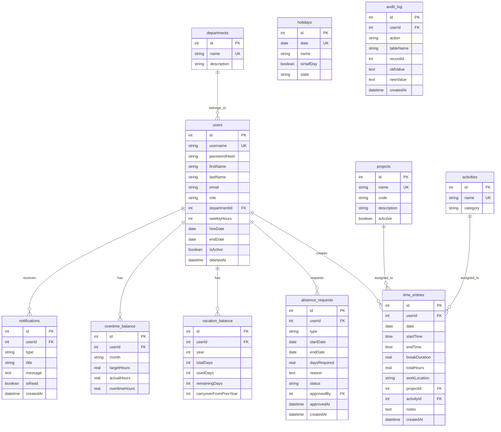

# TimeTracking System - Project Specification

**Document Version:** 1.0.0
**Last Updated:** 2026-01-15
**Status:** Production-Ready
**Compliance:** ISO/IEC/IEEE 29148 Standards

---

## Document Control

| Field | Value |
|-------|-------|
| **Project Name** | TimeTracking System - Enterprise Zeiterfassung |
| **Version** | v1.5.1 |
| **Classification** | Internal/Confidential |
| **Authors** | Development Team |
| **Stakeholders** | HR Management, Employees, System Administrators |
| **Review Frequency** | Quarterly |

---

## Table of Contents

1. [Executive Summary](#1-executive-summary)
2. [System Overview](#2-system-overview)
3. [Functional Requirements](#3-functional-requirements)
4. [Non-Functional Requirements](#4-non-functional-requirements)
5. [Data Model](#5-data-model)
6. [API Specification](#6-api-specification)
7. [User Interface Specification](#7-user-interface-specification)
8. [Security & Privacy](#8-security--privacy)
9. [Deployment & Operations](#9-deployment--operations)
10. [Testing Strategy](#10-testing-strategy)
11. [Dependencies & Constraints](#11-dependencies--constraints)
12. [Glossary](#12-glossary)
13. [Appendix](#13-appendix)

---

## 1. Executive Summary

### 1.1 Project Description

**TimeTracking System** is a production-ready, cloud-based time tracking and absence management solution designed for small to medium-sized enterprises (SMEs) in Germany. The system provides multi-user time tracking, absence management, overtime calculations, and comprehensive reporting capabilities while ensuring DSGVO compliance.

**Key Value Proposition:**
- Zero-configuration desktop apps for Windows, macOS, and Linux
- Cloud-first architecture with Oracle Cloud backend (Frankfurt)
- Real-time synchronization across all clients
- Native performance with 15 MB app size (vs. 100+ MB Electron apps)
- German labor law compliance (Arbeitszeitgesetz - ArbZG)

### 1.2 Business Goals

1. **Operational Efficiency**: Reduce time tracking overhead by 80%
2. **Compliance**: 100% DSGVO compliance and ArbZG adherence
3. **User Adoption**: >90% employee adoption within 30 days
4. **Cost**: €0 infrastructure costs (Oracle Free Tier)
5. **Reliability**: 99.5% uptime SLA

### 1.3 Key Stakeholders

| Role | Responsibilities | Primary Concerns |
|------|------------------|------------------|
| **HR Manager** | Approve absences, manage vacation balances | Compliance, accurate reporting |
| **System Administrator** | User management, system configuration | Security, reliability, backups |
| **Employees** | Track time, request absences | Ease of use, transparency |
| **Management** | Review reports, monitor team workload | Insights, cost control |

### 1.4 Project Scope

**In Scope:**
- ✅ Manual time entry (start/end/break times)
- ✅ Absence management (vacation, sick leave, overtime compensation)
- ✅ Overtime tracking and compensation
- ✅ Calendar views (individual and team)
- ✅ CSV export for payroll systems
- ✅ Desktop applications (Windows, macOS, Linux)
- ✅ Real-time synchronization
- ✅ Auto-update system

**Out of Scope:**
- ❌ Biometric time tracking (NFC, QR codes)
- ❌ Mobile apps (iOS, Android)
- ❌ Integration with payroll systems (API only)
- ❌ Multi-tenant support
- ❌ Advanced analytics/BI dashboards

---

## 2. System Architecture

**For complete system architecture, technology stack, deployment details, and design decisions, please refer to:**

**📐 [ARCHITECTURE.md](ARCHITECTURE.md)** - Software Architecture Documentation

**Key Architecture Highlights:**
- **Style:** Cloud-First Architecture (centralized Oracle Cloud server + thin desktop clients)
- **Frontend:** Tauri 2.x + React 18 + TypeScript (15 MB app size)
- **Backend:** Node.js 20 + Express + SQLite (WAL mode for multi-user)
- **Deployment:** Oracle Cloud Free Tier (Frankfurt, Germany - DSGVO compliant)
- **CI/CD:** GitHub Actions (automated builds & deployments)

**Why this architecture?**
1. **Zero Configuration:** No IT setup required for end users
2. **Real-time Sync:** Instant synchronization across all devices
3. **Native Performance:** Tauri (Rust) vs. Electron (100+ MB)
4. **Cost:** €0 infrastructure (Oracle Free Tier)

**System Requirements:**
- **Client:** Windows 10+, macOS 10.15+, Ubuntu 20.04+ | 2 GB RAM | 100 MB disk
- **Network:** 1 Mbps minimum (10 Mbps recommended)
- **Server:** Already deployed on Oracle Cloud (Frankfurt)

---

## 3. Functional Requirements

### 3.1 User Roles & Permissions

| Role | Permissions | Use Cases |
|------|-------------|-----------|
| **Admin** | Full system access, user management, approve absences, override data | HR Manager, System Administrator |
| **Employee** | Track own time, request absences, view own reports | All staff members |

### 3.2 Feature Modules

#### 3.2.1 Authentication & User Management

**FR-AUTH-001: User Authentication** (Priority: P0 - Critical)

**Description:** Secure login system with session management.

**User Story:**
*As an employee, I want to securely log in to the system so that only I can access my time tracking data.*

**Acceptance Criteria:**
- ✅ Login with username and password
- ✅ Password hashed with bcrypt (10 rounds)
- ✅ HttpOnly session cookies (24-hour expiry)
- ✅ Failed login attempts are logged
- ✅ Session persists across app restarts
- ✅ Logout clears session completely

**API Endpoints:**
- `POST /api/auth/login` - Authenticate user
- `POST /api/auth/logout` - End session
- `GET /api/auth/me` - Get current user info

---

**FR-USER-001: User Management (Admin)** (Priority: P0 - Critical)

**Description:** CRUD operations for user accounts.

**User Story:**
*As an admin, I want to create, edit, and deactivate user accounts so that I can manage team access.*

**Acceptance Criteria:**
- ✅ Create user with unique username/email
- ✅ Edit user details (name, email, role, weekly hours, hire date)
- ✅ Deactivate user (soft delete, not permanent removal)
- ✅ Reactivate deactivated user
- ✅ Set end date for temporary employees
- ✅ Assign weekly target hours (1-80 hours)
- ✅ Cannot delete users with time entries (data integrity)

**Validation Rules:**
- Username: 3-50 characters, alphanumeric + underscore
- Email: Valid email format (optional)
- Password: Minimum 6 characters (dev), 8+ recommended (production)
- Weekly Hours: 1-80 hours (typical: 20, 30, 40)
- Hire Date: Cannot be in future

**Data Model:** See `users` table in Section 5.

---

#### 3.2.2 Time Tracking

**FR-TIME-001: Manual Time Entry** (Priority: P0 - Critical)

**Description:** Record work hours with start time, end time, and breaks.

**User Story:**
*As an employee, I want to log my working hours for each day so that my work time is accurately tracked.*

**Acceptance Criteria:**
- ✅ Create time entry with date, start time, end time, break duration
- ✅ Select work location (office, home office, field work)
- ✅ Assign to project and activity (optional)
- ✅ Add notes/description (optional)
- ✅ System calculates total hours automatically
- ✅ Cannot create entries in future (production mode)
- ✅ Cannot create entries before hire date
- ✅ Validation: Start < End time
- ✅ Validation: Break duration < total work time
- ✅ Overlap detection (no double-booking)

**Calculation:**
```
Total Hours = (End Time - Start Time) - Break Duration
Example: 09:00 - 17:30 (8.5h) - 0.5h break = 8.0h worked
```

**API Endpoints:**
- `POST /api/time-entries` - Create entry
- `GET /api/time-entries?month=2026-01` - Get entries for month
- `PUT /api/time-entries/:id` - Update entry
- `DELETE /api/time-entries/:id` - Delete entry

---

**FR-TIME-002: Overtime Tracking** (Priority: P0 - Critical)

**Description:** Automatic calculation of overtime based on target vs. actual hours.

**User Story:**
*As an employee, I want to see my current overtime balance so that I know if I can take time off.*

**⚠️ CRITICAL: Single Source of Truth**

The **overtime_balance** table is the AUTHORITATIVE source for all overtime data. All frontend reports and APIs MUST read from this table, NOT recalculate!

**Database Table (Single Source of Truth):**
```sql
overtime_balance (
  userId INTEGER,
  month TEXT,              -- "YYYY-MM"
  targetHours REAL,        -- Calculated by overtimeService.ts
  actualHours REAL,        -- Worked + Absence Credits
  overtime REAL VIRTUAL    -- (actualHours - targetHours)
)
```

**Formula:**
```
Überstunden = Ist-Stunden - Soll-Stunden

Where:
- Soll-Stunden (Target) = Arbeitstage × Ziel-Stunden pro Tag
- Ist-Stunden (Actual)  = Gearbeitete Stunden + Abwesenheits-Gutschriften
- Arbeitstage (Working Days) = Wochentage minus Wochenenden und Feiertage

CRITICAL: Reference date is ALWAYS TODAY, not month end!
```

**Calculation Modes:**

**Mode 1: Standard Weekly Hours**
```typescript
const user = { weeklyHours: 40, workSchedule: null };
Daily Target = 40h ÷ 5 = 8h/day
Working Days = Monday-Friday
```

**Mode 2: Individual Work Schedule (Priority over weeklyHours!)**
```typescript
const user = {
  weeklyHours: 30,  // IGNORED if workSchedule exists!
  workSchedule: {
    monday: 8,      // 8h
    tuesday: 0,     // NOT a working day!
    wednesday: 6,   // 6h
    thursday: 8,    // 8h
    friday: 8,      // 8h
  }
};
// Days with hours > 0 count as working days
// Days with hours = 0 do NOT count (even if weekday!)
```

**Example Calculation:**
```
Employee: Max Mustermann
Hire Date: 2026-01-01
Weekly Hours: 40h (= 8h/day target)
Current Date: 2026-01-15 (15 days elapsed)

Working Days: 10 days (excluding weekends + holidays)
Target Hours: 10 days × 8h = 80h
Actual Hours: 85h (worked)
Overtime: 85h - 80h = +5h
```

**Absence Credits:**
- **Vacation**: Days × Daily Target Hours (e.g., 3 days vacation = 24h credit)
- **Sick Leave**: Days × Daily Target Hours
- **Overtime Compensation**: Days × Daily Target Hours
- **Special Leave**: Days × Daily Target Hours
- **Unpaid Leave**: Reduces target hours (NO credit!)

**Unpaid Leave Special Handling:**
```typescript
// Unpaid leave REDUCES Soll-Stunden, does NOT give Ist-Stunden credit!
const targetHours = 5 days × 8h = 40h;
const unpaidLeaveDays = 2 days;
const adjustedTarget = 40h - (2 × 8h) = 24h;  // Reduced!
const actualHours = 24h;  // NO credit for unpaid days!
const overtime = 24h - 24h = 0h;
```

**Timezone Handling (CRITICAL!):**
```typescript
// ✅ CORRECT: Use formatDate() for Europe/Berlin timezone
const endDate = formatDate(new Date(year, month, 0), 'yyyy-MM-dd');

// ❌ WRONG: toISOString() converts to UTC (off-by-one-day bug!)
const endDate = new Date(year, month, 0).toISOString().split('T')[0];
// Example: 2025-12-31 00:00 (Berlin) → 2025-12-30 23:00 (UTC) → "2025-12-30" ❌
```

**UI Display:**
- Target Hours (Soll): Gray, Clock icon
- Actual Hours (Ist): Blue, CheckCircle icon
- Overtime (Differenz): Green (+) / Red (-), TrendingUp/Down icon

**API Endpoints:**

**RECOMMENDED (Read from Database ✅):**
```
GET /api/overtime/balance?userId=5&year=2026        → overtime_balance ✅
GET /api/overtime/month/:userId/:month              → overtime_balance ✅
GET /api/reports/overtime/history/:userId           → overtime_balance ✅
GET /api/reports/overtime/year-breakdown/:userId    → overtime_balance ✅
```

**⚠️ PROBLEMATIC (Recalculates instead of reading DB!):**
```
GET /api/reports/overtime/user/:userId?year=2026&month=12  → reportService ❌
```

**Known Issue:** This endpoint uses `reportService.ts` which recalculates overtime instead of reading from `overtime_balance`. This can cause discrepancies!

**Recommendation:** Refactor `/api/reports/overtime/user/:userId` to read from `overtime_balance` table instead of recalculating.

---

#### 3.2.3 Absence Management

**FR-ABS-001: Absence Request Creation** (Priority: P0 - Critical)

**Description:** Employees request absences (vacation, sick leave, etc.).

**User Story:**
*As an employee, I want to request vacation days so that my absence is officially recorded and approved.*

**Absence Types:**
| Type | Code | Requires Approval | Credits Hours | Deducts Vacation Days |
|------|------|-------------------|---------------|-----------------------|
| Vacation | `vacation` | Yes (Admin) | Yes | Yes |
| Sick Leave | `sick` | No (Auto-approved) | Yes | No |
| Overtime Compensation | `overtime_comp` | Yes (Admin) | Yes | No |
| Special Leave | `special` | Yes (Admin) | Yes | No |
| Unpaid Leave | `unpaid` | Yes (Admin) | No | No |

**Acceptance Criteria:**
- ✅ Select start date and end date
- ✅ System calculates required days (excluding weekends and holidays)
- ✅ Select absence type
- ✅ Add optional note/reason
- ✅ Validation: Cannot request absence before hire date
- ✅ Validation: Cannot overlap with existing approved absences
- ✅ Validation: Vacation requests cannot exceed available balance
- ✅ Desktop notification when status changes (pending → approved/rejected)

**Strict Absence Validation** (Added in v1.5.0):
- ✅ Cannot create time entries during pending or approved absences
- ✅ Error message: "Cannot create time entry during absence period"
- ✅ Prevents data conflicts and payroll errors

**Workflow:**
1. Employee creates absence request → Status: `pending`
2. Admin reviews and approves/rejects
3. If approved → Status: `approved`, hours credited, vacation balance updated
4. If rejected → Status: `rejected`, no changes

**API Endpoints:**
- `POST /api/absences` - Create absence request
- `GET /api/absences?status=pending` - Get absences by status
- `PUT /api/absences/:id/approve` - Approve request (Admin)
- `PUT /api/absences/:id/reject` - Reject request (Admin)

---

**FR-ABS-002: Vacation Balance Management** (Priority: P0 - Critical)

**Description:** Track vacation days per year with carryover logic.

**User Story:**
*As an employee, I want to see my remaining vacation days so that I can plan my time off.*

**German Law Compliance:**
- Minimum vacation days: 20 days/year (based on 5-day work week)
- Carryover: Max 5 days from previous year (until March 31)
- Carryover expires: Unused carryover lost after March 31

**Data Structure (per user per year):**
```typescript
{
  year: 2026,
  totalDays: 30,           // Annual entitlement
  usedDays: 10,            // Days already taken
  remainingDays: 20,       // Available days
  carryoverFromPrevYear: 5 // Max 5 days from 2025
}
```

**Calculation:**
```
Remaining Days = Total Days + Carryover - Used Days

Example:
- Total 2026: 30 days
- Carryover from 2025: 5 days
- Used in 2026: 10 days
- Remaining: 30 + 5 - 10 = 25 days
```

**Validation:**
- Carryover ≤ min(Previous Year Remaining, 5 days)
- Total Days ≥ 20 (German minimum)
- Used Days cannot be negative

**API Endpoints:**
- `GET /api/vacation-balance/user/:id?year=2026` - Get balance for year
- `PUT /api/vacation-balance/user/:id` - Update balance (Admin)

---

#### 3.2.4 Calendar & Holidays

**FR-CAL-001: Calendar Views** (Priority: P1 - High)

**Description:** Visual calendar with time entries, absences, and holidays.

**User Story:**
*As an employee, I want to see a calendar view of my work schedule so that I can plan my time effectively.*

**Views:**
1. **Month View** - Grid layout with color-coded entries
2. **Week View** - Detailed hourly breakdown (7 days)
3. **Year View** - Annual overview with vacation and absences
4. **Team View** - Who's working/absent today (Admin only)

**Color Coding:**
- 🟦 **Blue**: Time entries (working days)
- 🟩 **Green**: Approved vacation
- 🟨 **Yellow**: Pending absence request
- 🟥 **Red**: Sick leave
- ⚫ **Gray**: Public holidays

**API Endpoints:**
- `GET /api/calendar?month=2026-01&userId=5` - Get calendar data

---

**FR-HOL-001: Public Holidays Management** (Priority: P1 - High)

**Description:** Manage German public holidays (federal and state-specific).

**User Story:**
*As an admin, I want to configure public holidays so that working days are calculated correctly.*

**German Public Holidays (Federal):**
- New Year's Day (Jan 1)
- Good Friday (variable)
- Easter Monday (variable)
- Labour Day (May 1)
- Ascension Day (variable, 39 days after Easter)
- Whit Monday (variable, 50 days after Easter)
- German Unity Day (Oct 3)
- Christmas Day (Dec 25)
- Boxing Day (Dec 26)

**State-Specific Holidays:**
- Epiphany (Jan 6) - Bavaria, Baden-Württemberg
- Corpus Christi (variable) - Bavaria, etc.
- Reformation Day (Oct 31) - Brandenburg, etc.
- All Saints' Day (Nov 1) - Bavaria, etc.

**Features:**
- ✅ Pre-populated with German federal holidays
- ✅ Add custom holidays (company-specific days off)
- ✅ Mark as full-day or half-day holiday
- ✅ Exclude from working days calculation

**API Endpoints:**
- `GET /api/holidays?year=2026` - Get holidays for year
- `POST /api/holidays` - Add custom holiday (Admin)
- `DELETE /api/holidays/:id` - Remove custom holiday (Admin)

---

#### 3.2.5 Reports & Export

**FR-REP-001: CSV Export** (Priority: P1 - High)

**Description:** Export time tracking data for payroll processing.

**User Story:**
*As an admin, I want to export time data as CSV so that I can import it into our payroll system.*

**Export Formats:**

**1. DATEV Export** (German Payroll Standard)
```csv
Personal-Nr,Datum,Stunden,Projekt,Aktivität,Bemerkung
12345,01.01.2026,8.00,Projekt A,Entwicklung,Remote
```

**2. Generic CSV**
```csv
Employee ID,Name,Date,Hours,Location,Project,Activity,Notes
5,Max Mustermann,2026-01-15,8.5,Office,Project A,Development,
```

**Features:**
- ✅ Select date range (start/end date)
- ✅ Filter by user (single or all)
- ✅ Filter by project
- ✅ Include/exclude absences
- ✅ UTF-8 encoding (German umlauts: ä, ö, ü, ß)
- ✅ Date format: DD.MM.YYYY (German standard)
- ✅ Decimal separator: Comma (German standard: 8,5 instead of 8.5)

**API Endpoints:**
- `GET /api/exports/datev?start=2026-01-01&end=2026-01-31` - DATEV CSV
- `GET /api/exports/csv?start=2026-01-01&end=2026-01-31&userId=5` - Generic CSV

---

**FR-REP-002: Statistics Dashboard** (Priority: P2 - Medium)

**Description:** Visual overview of key metrics.

**User Story:**
*As an employee, I want to see my statistics at a glance so that I understand my work patterns.*

**Metrics:**
- Total hours worked (current month)
- Target hours (Sollstunden)
- Overtime balance (cumulative)
- Vacation days remaining
- Absences this month
- Work location breakdown (Office vs. Home Office %)

**Admin Dashboard (additional metrics):**
- Team total hours
- Who's absent today
- Pending absence requests count
- Average overtime per employee

---

### 3.3 Feature Priority Matrix

| Priority | Definition | Features |
|----------|------------|----------|
| **P0 - Critical** | Core functionality, system cannot function without | Auth, User Management, Time Tracking, Absence Management, Overtime Calculation |
| **P1 - High** | Important features, significantly impacts UX | Calendar Views, Holidays, CSV Export, Vacation Balance |
| **P2 - Medium** | Nice-to-have, improves usability | Statistics Dashboard, Dark Mode, Keyboard Shortcuts |
| **P3 - Low** | Future enhancements | Mobile apps, Biometric tracking, Advanced analytics |

---

## 4. Non-Functional Requirements

### 4.1 Performance

**NFR-PERF-001: Response Time**
- API response time (p95): < 200ms for database queries
- API response time (p99): < 500ms
- Desktop app startup time: < 2 seconds
- Calendar load time: < 1 second (for 1 year of data)

**NFR-PERF-002: Concurrent Users**
- Support: 50 concurrent users
- Database: SQLite WAL mode for multi-user write access
- WebSocket connections: 100 simultaneous connections

**NFR-PERF-003: Data Volume**
- Time entries: 100,000+ entries without performance degradation
- Users: 200 users maximum (SQLite limitation)
- Database size: < 500 MB (expected: ~50 MB for 50 users/year)

---

### 4.2 Security

**NFR-SEC-001: Authentication & Authorization**
- ✅ Password hashing: bcrypt (10 rounds, salt)
- ✅ Session management: HttpOnly cookies, 24h expiry
- ✅ Role-based access control (RBAC): Admin vs. Employee
- ✅ Failed login attempts logged in audit log
- ❌ NOT IMPLEMENTED: Account lockout after 5 failed attempts (future)
- ❌ NOT IMPLEMENTED: 2FA/MFA (future)

**NFR-SEC-002: Data Protection**
- ✅ SQL Injection prevention: Prepared statements (better-sqlite3)
- ✅ XSS prevention: React auto-escaping + input sanitization
- ✅ CSRF protection: SameSite=Strict cookies
- ✅ Secure communication: HTTPS (Oracle Cloud with Let's Encrypt)
- ✅ Input validation: Frontend + Backend double validation

**NFR-SEC-003: Cryptographic Standards**
- Password hashing: bcrypt (OpenBSD Blowfish cipher)
- Session cookies: Signed with 256-bit secret
- Auto-update signatures: Ed25519 (minisign)

**NFR-SEC-004: Audit Trail**
- All write operations logged to `audit_log` table
- Logged events: Login, user creation/update, time entry changes, absence approvals
- Log retention: 4 years (DSGVO compliance)

---

### 4.3 Reliability

**NFR-REL-001: Uptime**
- Target: 99.5% uptime (SLA)
- Allowed downtime: ~3.65 hours/month
- Zero-downtime deployments: PM2 cluster mode

**NFR-REL-002: Data Integrity**
- Database WAL mode: Atomic commits, crash recovery
- Foreign key constraints: Referential integrity enforced
- Soft deletes: `deletedAt` timestamp (no data loss)
- Backup strategy: See NFR-REL-003

**NFR-REL-003: Backup & Recovery**
- Automated daily backups: 2 AM UTC (cron job)
- GFS rotation:
  - Daily: 7 days retention
  - Weekly: 4 weeks retention
  - Monthly: 12 months retention
- Backup location: `/home/ubuntu/TimeTracking-Clean/backups/`
- Backup verification: SQLite integrity check (`PRAGMA integrity_check`)
- Recovery time objective (RTO): < 1 hour
- Recovery point objective (RPO): < 24 hours

---

### 4.4 Scalability

**NFR-SCAL-001: Horizontal Scalability**
- Current: Single Oracle Cloud instance
- Limitation: SQLite does not support horizontal scaling
- Migration path: Upgrade to PostgreSQL when >100 users

**NFR-SCAL-002: Vertical Scalability**
- Oracle Free Tier: 1 vCPU, 1 GB RAM
- Upgrade path: Oracle Cloud paid tiers (2-8 vCPUs)

---

### 4.5 Usability

**NFR-USE-001: User Interface**
- Modern, clean design (Tailwind CSS)
- Dark mode support (auto-detect system preference + manual toggle)
- Responsive layout: Min 1280x720, optimal 1920x1080
- Keyboard shortcuts for power users (e.g., `Ctrl+N` new entry)
- Toast notifications for all actions (success/error feedback)

**NFR-USE-002: Accessibility**
- Semantic HTML tags
- ARIA labels for screen readers
- Keyboard navigation support
- High contrast mode compatible

**NFR-USE-003: Internationalization**
- Current: German language only (UI + date formats)
- Future: English locale (requires i18n library)

**NFR-USE-004: Help & Documentation**
- In-app tooltips on hover
- README.md for users
- PROJECT_SPEC.md for developers

---

### 4.6 Maintainability

**NFR-MAIN-001: Code Quality**
- TypeScript strict mode: No `any` types allowed
- ESLint + Prettier: Enforced code style
- Test coverage: >70% (goal: >80%)
- Code review required for all changes

**NFR-MAIN-002: Documentation**
- API endpoints documented in this spec
- Inline code comments for complex logic
- Database schema documented in Section 5
- CLAUDE.md: AI development guidelines

**NFR-MAIN-003: Monitoring**
- Server logs: PM2 log rotation (JSON format)
- Health check endpoint: `/api/health`
- Error tracking: Console logs (future: Sentry integration)

---

### 4.7 Compliance

**NFR-COMP-001: DSGVO (GDPR)**
- Data storage: Germany (Frankfurt)
- Data retention: 4 years (tax law requirement)
- Right to erasure: Soft delete + anonymization after 4 years
- Data portability: CSV export
- Consent: Implicit consent via employment contract
- Data processor agreement: Not required (internal use)

**NFR-COMP-002: German Labor Law (Arbeitszeitgesetz - ArbZG)**
- Working hours recording: § 3 ArbZG compliance
- Maximum working hours: 8 hours/day (averaged over 6 months)
- Overtime tracking: Accurate calculation
- Vacation days: Minimum 20 days/year (§ 3 BUrlG)
- Vacation carryover: Until March 31 next year (§ 7 BUrlG)

**NFR-COMP-003: Data Privacy**
- No external tracking/analytics
- No third-party data sharing
- Secure session management
- Audit log for accountability

---

## 5. Data Model

### 5.1 Entity Relationship Diagram



### 5.2 Table Definitions

#### 5.2.1 users

**Purpose:** Store employee and admin accounts.

| Column | Type | Constraints | Description |
|--------|------|-------------|-------------|
| `id` | INTEGER | PRIMARY KEY | Auto-increment user ID |
| `username` | TEXT | UNIQUE, NOT NULL | Login username (3-50 chars) |
| `passwordHash` | TEXT | NOT NULL | bcrypt hash (60 chars) |
| `firstName` | TEXT | NOT NULL | First name |
| `lastName` | TEXT | NOT NULL | Last name |
| `email` | TEXT | UNIQUE | Email (optional, validated) |
| `role` | TEXT | NOT NULL, CHECK | 'admin' or 'employee' |
| `departmentId` | INTEGER | FOREIGN KEY | FK to departments.id |
| `weeklyHours` | INTEGER | NOT NULL, CHECK | 1-80 hours/week |
| `hireDate` | TEXT | NOT NULL | ISO 8601 date (YYYY-MM-DD) |
| `endDate` | TEXT | | End date for temp employees |
| `isActive` | INTEGER | DEFAULT 1 | 1=active, 0=deactivated |
| `deletedAt` | TEXT | | Soft delete timestamp |
| `createdAt` | TEXT | DEFAULT NOW | Creation timestamp |
| `updatedAt` | TEXT | DEFAULT NOW | Last update timestamp |

**Indexes:**
- `CREATE UNIQUE INDEX idx_users_username ON users(username)`
- `CREATE INDEX idx_users_email ON users(email)`

**Business Rules:**
- `hireDate` cannot be in future
- `endDate` must be after `hireDate`
- `weeklyHours` typically: 20 (part-time), 30 (3/4), 40 (full-time)

---

#### 5.2.2 time_entries

**Purpose:** Record daily work hours.

| Column | Type | Constraints | Description |
|--------|------|-------------|-------------|
| `id` | INTEGER | PRIMARY KEY | Auto-increment entry ID |
| `userId` | INTEGER | FOREIGN KEY, NOT NULL | FK to users.id |
| `date` | TEXT | NOT NULL | Work date (YYYY-MM-DD) |
| `startTime` | TEXT | NOT NULL | Start time (HH:MM) |
| `endTime` | TEXT | NOT NULL | End time (HH:MM) |
| `breakDuration` | REAL | DEFAULT 0 | Break in hours (e.g., 0.5) |
| `totalHours` | REAL | NOT NULL | Calculated: (end - start) - break |
| `workLocation` | TEXT | NOT NULL | 'office', 'home', 'field', 'client' |
| `projectId` | INTEGER | FOREIGN KEY | FK to projects.id (optional) |
| `activityId` | INTEGER | FOREIGN KEY | FK to activities.id (optional) |
| `notes` | TEXT | | Optional description |
| `createdAt` | TEXT | DEFAULT NOW | Creation timestamp |
| `updatedAt` | TEXT | DEFAULT NOW | Last update timestamp |
| `deletedAt` | TEXT | | Soft delete timestamp |

**Indexes:**
- `CREATE INDEX idx_time_entries_user_date ON time_entries(userId, date)`
- `CREATE INDEX idx_time_entries_project ON time_entries(projectId)`

**Business Rules:**
- `startTime` < `endTime` (unless overnight shift)
- `breakDuration` < `totalHours`
- Cannot create entry before user's `hireDate`
- Cannot overlap with existing entry (per user)
- **Strict rule**: Cannot create entry during approved/pending absence

---

#### 5.2.3 absence_requests

**Purpose:** Track vacation, sick leave, and other absences.

| Column | Type | Constraints | Description |
|--------|------|-------------|-------------|
| `id` | INTEGER | PRIMARY KEY | Auto-increment request ID |
| `userId` | INTEGER | FOREIGN KEY, NOT NULL | FK to users.id |
| `type` | TEXT | NOT NULL, CHECK | 'vacation', 'sick', 'overtime_comp', 'special', 'unpaid' |
| `startDate` | TEXT | NOT NULL | Start date (YYYY-MM-DD) |
| `endDate` | TEXT | NOT NULL | End date (inclusive) |
| `daysRequired` | REAL | NOT NULL | Number of working days |
| `reason` | TEXT | | Optional note |
| `status` | TEXT | NOT NULL, CHECK | 'pending', 'approved', 'rejected' |
| `approvedBy` | INTEGER | FOREIGN KEY | FK to users.id (admin) |
| `approvedAt` | TEXT | | Approval timestamp |
| `createdAt` | TEXT | DEFAULT NOW | Request creation timestamp |
| `updatedAt` | TEXT | DEFAULT NOW | Last update timestamp |
| `deletedAt` | TEXT | | Soft delete timestamp |

**Indexes:**
- `CREATE INDEX idx_absence_requests_user_dates ON absence_requests(userId, startDate, endDate)`
- `CREATE INDEX idx_absence_requests_status ON absence_requests(status)`

**Business Rules:**
- `endDate` >= `startDate`
- `daysRequired` = working days between start and end (excluding weekends, holidays)
- Vacation requests: `daysRequired` <= remaining vacation balance
- Cannot overlap with existing approved absences
- Sick leave: Auto-approved (`status` = 'approved')
- Other types: Require admin approval

---

#### 5.2.4 vacation_balance

**Purpose:** Track annual vacation entitlement and usage.

| Column | Type | Constraints | Description |
|--------|------|-------------|-------------|
| `id` | INTEGER | PRIMARY KEY | Auto-increment ID |
| `userId` | INTEGER | FOREIGN KEY, NOT NULL | FK to users.id |
| `year` | INTEGER | NOT NULL | Calendar year (e.g., 2026) |
| `totalDays` | INTEGER | NOT NULL | Annual entitlement (≥ 20) |
| `usedDays` | INTEGER | DEFAULT 0 | Days already taken |
| `remainingDays` | INTEGER | COMPUTED | `totalDays + carryover - usedDays` |
| `carryoverFromPrevYear` | INTEGER | DEFAULT 0 | Max 5 days from previous year |
| `createdAt` | TEXT | DEFAULT NOW | Creation timestamp |
| `updatedAt` | TEXT | DEFAULT NOW | Last update timestamp |

**Indexes:**
- `CREATE UNIQUE INDEX idx_vacation_balance_user_year ON vacation_balance(userId, year)`

**Business Rules:**
- `totalDays` >= 20 (German minimum)
- `carryoverFromPrevYear` <= 5
- `usedDays` cannot exceed `totalDays + carryoverFromPrevYear`
- Carryover expires after March 31

---

#### 5.2.5 overtime_balance

**Purpose:** Monthly overtime tracking (calculated, not manually entered).

| Column | Type | Constraints | Description |
|--------|------|-------------|-------------|
| `id` | INTEGER | PRIMARY KEY | Auto-increment ID |
| `userId` | INTEGER | FOREIGN KEY, NOT NULL | FK to users.id |
| `month` | TEXT | NOT NULL | YYYY-MM format |
| `targetHours` | REAL | NOT NULL | Working days × daily target |
| `actualHours` | REAL | NOT NULL | Worked + absence credits |
| `overtimeHours` | REAL | NOT NULL | `actualHours - targetHours` |
| `createdAt` | TEXT | DEFAULT NOW | Calculation timestamp |
| `updatedAt` | TEXT | DEFAULT NOW | Last recalculation timestamp |

**Indexes:**
- `CREATE UNIQUE INDEX idx_overtime_balance_user_month ON overtime_balance(userId, month)`

**Business Rules:**
- Recalculated monthly (end of month cron job)
- Can also be recalculated on-demand via API

---

#### 5.2.6 Other Tables (Brief)

**departments**
- `id`, `name`, `description`
- Examples: Engineering, Sales, HR

**projects**
- `id`, `name`, `code`, `description`, `isActive`
- Examples: Project A, Internal, Training

**activities**
- `id`, `name`, `category`
- Examples: Development, Meeting, Research

**holidays**
- `id`, `date`, `name`, `isHalfDay`, `state`
- German federal + state holidays

**notifications**
- `id`, `userId`, `type`, `title`, `message`, `isRead`, `createdAt`
- Desktop push notifications

**audit_log**
- `id`, `userId`, `action`, `tableName`, `recordId`, `oldValue`, `newValue`, `createdAt`
- Compliance and security audit trail

---

### 5.3 Data Retention Policy

| Data Type | Retention Period | Deletion Method |
|-----------|------------------|-----------------|
| **Time Entries** | 4 years | Soft delete, then hard delete |
| **Absence Requests** | 4 years | Soft delete, then hard delete |
| **Audit Log** | 4 years | Hard delete (DSGVO) |
| **User Accounts** | Indefinite (deactivated) | Soft delete, never hard delete |
| **Vacation Balances** | Current year + 1 | Archive after 2 years |
| **Overtime Balances** | Current year + 4 | Archive after 5 years |

**Automated Cleanup:**
- Script: `scripts/database/cleanup.sh`
- Schedule: Annually (January 1, 3 AM)
- Dry-run mode available: `./cleanup.sh --dry-run`

---

## 6. API Specification

### 6.1 Base URL

**Development:** `http://localhost:3000/api`
**Production:** `https://129.159.8.19:3000/api`

### 6.2 Authentication

All API endpoints (except `/auth/login`) require authentication via session cookie.

**Session Cookie:**
- Name: `connect.sid`
- HttpOnly: `true`
- Secure: `true` (production)
- SameSite: `Strict`
- Max-Age: 86400 seconds (24 hours)

**Unauthorized Response:**
```json
HTTP 401 Unauthorized
{
  "success": false,
  "error": "Unauthorized"
}
```

---

### 6.3 REST Endpoints

#### 6.3.1 Authentication

**POST /api/auth/login**

Authenticate user and create session.

**Request:**
```json
{
  "username": "max.mustermann",
  "password": "password123"
}
```

**Response (Success):**
```json
HTTP 200 OK
{
  "success": true,
  "data": {
    "id": 5,
    "username": "max.mustermann",
    "firstName": "Max",
    "lastName": "Mustermann",
    "email": "max@example.com",
    "role": "employee",
    "departmentId": 1,
    "weeklyHours": 40,
    "hireDate": "2026-01-01",
    "isActive": true
  }
}
```

**Response (Failure):**
```json
HTTP 401 Unauthorized
{
  "success": false,
  "error": "Invalid credentials"
}
```

---

**POST /api/auth/logout**

End session and clear cookie.

**Response:**
```json
HTTP 200 OK
{
  "success": true
}
```

---

**GET /api/auth/me**

Get current logged-in user info.

**Response:**
```json
HTTP 200 OK
{
  "success": true,
  "data": { /* user object */ }
}
```

---

#### 6.3.2 Users

**GET /api/users**

Get all users (Admin only).

**Query Parameters:**
- `includeInactive` (boolean): Include deactivated users (default: false)

**Response:**
```json
HTTP 200 OK
{
  "success": true,
  "data": [
    { /* user object */ },
    { /* user object */ }
  ]
}
```

---

**POST /api/users**

Create new user (Admin only).

**Request:**
```json
{
  "username": "john.doe",
  "password": "password123",
  "firstName": "John",
  "lastName": "Doe",
  "email": "john@example.com",
  "role": "employee",
  "departmentId": 2,
  "weeklyHours": 40,
  "hireDate": "2026-01-15"
}
```

**Response:**
```json
HTTP 201 Created
{
  "success": true,
  "data": { /* created user object */ }
}
```

**Validation Errors:**
```json
HTTP 400 Bad Request
{
  "success": false,
  "error": "Username already exists"
}
```

---

**PUT /api/users/:id**

Update user (Admin only, or own profile).

**Request:**
```json
{
  "firstName": "John",
  "email": "newemail@example.com",
  "weeklyHours": 30
}
```

**Response:**
```json
HTTP 200 OK
{
  "success": true,
  "data": { /* updated user object */ }
}
```

---

**DELETE /api/users/:id**

Deactivate user (soft delete, Admin only).

**Response:**
```json
HTTP 200 OK
{
  "success": true
}
```

---

#### 6.3.3 Time Entries

**GET /api/time-entries**

Get time entries for current user.

**Query Parameters:**
- `month` (string): YYYY-MM format (e.g., "2026-01")
- `startDate` (string): YYYY-MM-DD
- `endDate` (string): YYYY-MM-DD

**Response:**
```json
HTTP 200 OK
{
  "success": true,
  "data": [
    {
      "id": 123,
      "userId": 5,
      "date": "2026-01-15",
      "startTime": "09:00",
      "endTime": "17:30",
      "breakDuration": 0.5,
      "totalHours": 8.0,
      "workLocation": "office",
      "projectId": 1,
      "activityId": 3,
      "notes": "Feature development",
      "createdAt": "2026-01-15T09:05:00Z"
    }
  ]
}
```

---

**POST /api/time-entries**

Create new time entry.

**Request:**
```json
{
  "date": "2026-01-15",
  "startTime": "09:00",
  "endTime": "17:30",
  "breakDuration": 0.5,
  "workLocation": "office",
  "projectId": 1,
  "activityId": 3,
  "notes": "Feature development"
}
```

**Response:**
```json
HTTP 201 Created
{
  "success": true,
  "data": { /* created entry */ }
}
```

**Validation Errors:**
```json
HTTP 400 Bad Request
{
  "success": false,
  "error": "Cannot create time entry during absence period (2026-01-15 to 2026-01-17)"
}
```

---

**PUT /api/time-entries/:id**

Update time entry.

**Request:** Same as POST

**Response:**
```json
HTTP 200 OK
{
  "success": true,
  "data": { /* updated entry */ }
}
```

---

**DELETE /api/time-entries/:id**

Delete time entry (soft delete).

**Response:**
```json
HTTP 200 OK
{
  "success": true
}
```

---

#### 6.3.4 Absences

**GET /api/absences**

Get absence requests.

**Query Parameters:**
- `status` (string): 'pending', 'approved', 'rejected', 'all'
- `userId` (number): Filter by user (Admin only)
- `startDate`, `endDate`: Date range

**Response:**
```json
HTTP 200 OK
{
  "success": true,
  "data": [
    {
      "id": 45,
      "userId": 5,
      "type": "vacation",
      "startDate": "2026-01-20",
      "endDate": "2026-01-24",
      "daysRequired": 5,
      "reason": "Family vacation",
      "status": "approved",
      "approvedBy": 1,
      "approvedAt": "2026-01-10T14:30:00Z",
      "createdAt": "2026-01-08T10:00:00Z"
    }
  ]
}
```

---

**POST /api/absences**

Create absence request.

**Request:**
```json
{
  "type": "vacation",
  "startDate": "2026-02-10",
  "endDate": "2026-02-14",
  "reason": "Personal trip"
}
```

**Response:**
```json
HTTP 201 Created
{
  "success": true,
  "data": { /* created absence request */ }
}
```

**Validation Errors:**
```json
HTTP 400 Bad Request
{
  "success": false,
  "error": "Insufficient vacation days. Required: 5, Available: 3"
}
```

---

**PUT /api/absences/:id/approve**

Approve absence request (Admin only).

**Response:**
```json
HTTP 200 OK
{
  "success": true,
  "data": { /* approved absence */ }
}
```

---

**PUT /api/absences/:id/reject**

Reject absence request (Admin only).

**Request:**
```json
{
  "reason": "Overlaps with project deadline"
}
```

**Response:**
```json
HTTP 200 OK
{
  "success": true,
  "data": { /* rejected absence */ }
}
```

---

#### 6.3.5 Overtime

**GET /api/overtime/user/:userId/total**

Get cumulative overtime for user.

**Response:**
```json
HTTP 200 OK
{
  "success": true,
  "data": {
    "userId": 5,
    "totalOvertime": 12.5,
    "lastCalculated": "2026-01-15T00:00:00Z"
  }
}
```

---

**GET /api/overtime/user/:userId?month=2026-01**

Get overtime breakdown for specific month.

**Response:**
```json
HTTP 200 OK
{
  "success": true,
  "data": {
    "userId": 5,
    "month": "2026-01",
    "targetHours": 160,
    "actualHours": 165.5,
    "overtimeHours": 5.5,
    "breakdown": {
      "workedHours": 158,
      "absenceCredits": 7.5
    }
  }
}
```

---

#### 6.3.6 Vacation Balance

**GET /api/vacation-balance/user/:userId?year=2026**

Get vacation balance for year.

**Response:**
```json
HTTP 200 OK
{
  "success": true,
  "data": {
    "userId": 5,
    "year": 2026,
    "totalDays": 30,
    "usedDays": 8,
    "remainingDays": 22,
    "carryoverFromPrevYear": 5
  }
}
```

---

**PUT /api/vacation-balance/user/:userId**

Update vacation balance (Admin only).

**Request:**
```json
{
  "year": 2026,
  "totalDays": 32,
  "carryoverFromPrevYear": 3
}
```

**Response:**
```json
HTTP 200 OK
{
  "success": true,
  "data": { /* updated balance */ }
}
```

---

#### 6.3.7 Exports

**GET /api/exports/datev?start=2026-01-01&end=2026-01-31**

Export DATEV CSV for payroll.

**Query Parameters:**
- `start`, `end` (required): Date range
- `userId` (optional): Single user or all
- `includeAbsences` (boolean): Include absences (default: false)

**Response:**
```csv
HTTP 200 OK
Content-Type: text/csv; charset=utf-8
Content-Disposition: attachment; filename="datev_export_2026-01.csv"

Personal-Nr,Datum,Stunden,Projekt,Aktivität,Bemerkung
00005,15.01.2026,8,00,Projekt A,Entwicklung,Feature XYZ
```

---

**GET /api/exports/csv**

Generic CSV export.

**Response:** Same structure, different format.

---

#### 6.3.8 Calendar

**GET /api/calendar?month=2026-01&userId=5**

Get calendar data for month.

**Response:**
```json
HTTP 200 OK
{
  "success": true,
  "data": {
    "month": "2026-01",
    "userId": 5,
    "days": [
      {
        "date": "2026-01-15",
        "isWeekend": false,
        "isHoliday": false,
        "timeEntry": { /* entry object */ },
        "absence": null
      },
      {
        "date": "2026-01-20",
        "isWeekend": false,
        "isHoliday": false,
        "timeEntry": null,
        "absence": { /* absence object */ }
      }
    ]
  }
}
```

---

#### 6.3.9 Holidays

**GET /api/holidays?year=2026**

Get holidays for year.

**Response:**
```json
HTTP 200 OK
{
  "success": true,
  "data": [
    {
      "id": 1,
      "date": "2026-01-01",
      "name": "Neujahr",
      "isHalfDay": false,
      "state": null
    },
    {
      "id": 2,
      "date": "2026-04-10",
      "name": "Karfreitag",
      "isHalfDay": false,
      "state": null
    }
  ]
}
```

---

**POST /api/holidays**

Add custom holiday (Admin only).

**Request:**
```json
{
  "date": "2026-12-24",
  "name": "Heiligabend (company holiday)",
  "isHalfDay": true,
  "state": null
}
```

**Response:**
```json
HTTP 201 Created
{
  "success": true,
  "data": { /* created holiday */ }
}
```

---

### 6.4 WebSocket Events

**Connection:** `wss://129.159.8.19:3000`

**Authentication:** Include session cookie in WebSocket handshake.

**Events (Server → Client):**

| Event | Payload | Description |
|-------|---------|-------------|
| `user:created` | `{ user }` | New user added (Admin only) |
| `user:updated` | `{ userId, changes }` | User profile updated |
| `time-entry:created` | `{ entry }` | New time entry added |
| `time-entry:updated` | `{ entryId, changes }` | Time entry modified |
| `time-entry:deleted` | `{ entryId }` | Time entry deleted |
| `absence:created` | `{ absence }` | New absence request |
| `absence:updated` | `{ absenceId, status }` | Absence approved/rejected |
| `notification:new` | `{ notification }` | New notification for user |

**Client Usage:**
```typescript
// Connect
const ws = new WebSocket('wss://129.159.8.19:3000');

// Listen for events
ws.onmessage = (event) => {
  const { type, payload } = JSON.parse(event.data);

  if (type === 'absence:updated') {
    // Refetch absence data
    queryClient.invalidateQueries(['absences']);
    // Show notification
    toast.success('Absence request approved!');
  }
};
```

---

### 6.5 Error Responses

Standard error format:

```json
HTTP 4xx/5xx
{
  "success": false,
  "error": "Human-readable error message"
}
```

**Common Error Codes:**

| Code | Meaning | Example |
|------|---------|---------|
| 400 | Bad Request | Invalid input, validation failed |
| 401 | Unauthorized | Not logged in, session expired |
| 403 | Forbidden | No permission (employee trying admin action) |
| 404 | Not Found | Resource doesn't exist |
| 409 | Conflict | Unique constraint violation (duplicate username) |
| 500 | Server Error | Unexpected error, check logs |

---

## 7. User Interface Specification

### 7.1 Navigation Structure

**Sidebar Menu:**
```
📊 Dashboard
⏱️ Time Tracking
   └─ Add Entry
   └─ My Entries
📅 Calendar
   └─ Month View
   └─ Week View
   └─ Year View
   └─ Team View (Admin)
🏖️ Absences
   └─ My Requests
   └─ Request Absence
   └─ Pending Approvals (Admin)
📈 Reports
   └─ My Statistics
   └─ Export CSV
   └─ Team Reports (Admin)
👥 Users (Admin)
   └─ All Users
   └─ Add User
⚙️ Settings
   └─ Profile
   └─ Appearance (Dark Mode)
   └─ Holidays (Admin)
```

---

### 7.2 Key User Flows

#### 7.2.1 Employee - Track Time

1. **Navigate:** Sidebar → Time Tracking → Add Entry
2. **Fill Form:**
   - Date: Today (pre-selected)
   - Start Time: 09:00 (manual input)
   - End Time: 17:30
   - Break: 0.5 hours
   - Location: Office (dropdown)
   - Project: Select from list (optional)
   - Activity: Select from list (optional)
   - Notes: Free text (optional)
3. **Submit:** Click "Save Entry"
4. **Feedback:** Green toast "Time entry created successfully"
5. **Auto-Calculate:** Total hours shown as 8.0h

---

#### 7.2.2 Employee - Request Vacation

1. **Navigate:** Sidebar → Absences → Request Absence
2. **Fill Form:**
   - Type: Vacation (dropdown)
   - Start Date: 2026-02-10 (date picker)
   - End Date: 2026-02-14 (date picker)
   - Reason: "Family vacation" (optional)
3. **Preview:** System shows "5 working days required"
4. **Validation:** System checks vacation balance (22 days available)
5. **Submit:** Click "Submit Request"
6. **Feedback:** Blue toast "Absence request submitted. Awaiting approval."
7. **Notification:** Desktop notification when admin approves/rejects

---

#### 7.2.3 Admin - Approve Absence

1. **Navigate:** Sidebar → Absences → Pending Approvals
2. **View List:** Table with all pending requests
   - Employee name, Type, Dates, Days, Reason
3. **Review:** Click row to expand details
4. **Decision:**
   - Click "Approve" (green button)
   - OR Click "Reject" (red button) → Enter rejection reason
5. **Feedback:** Toast "Absence approved"
6. **WebSocket:** Employee receives real-time notification

---

### 7.3 UI Components

#### 7.3.1 Time Entry Form

**Layout:**
```
┌─────────────────────────────────────────┐
│ Add Time Entry                          │
├─────────────────────────────────────────┤
│ Date: [2026-01-15] 📅                  │
│                                         │
│ Start Time: [09:00] 🕐                 │
│ End Time:   [17:30] 🕑                 │
│ Break:      [0.5] hours ⏸️             │
│                                         │
│ Total Hours: 8.0h (auto-calculated)    │
│                                         │
│ Location: [Office ▼] 📍                │
│ Project:  [Project A ▼] 📁 (optional) │
│ Activity: [Development ▼] 🔧 (optional)│
│                                         │
│ Notes: [                              ] │
│        [                              ] │
│                                         │
│ [Cancel]           [Save Entry] ✅     │
└─────────────────────────────────────────┘
```

**Validation:**
- Start time required
- End time required, must be after start
- Break duration < total time
- Date cannot be before hire date
- Cannot overlap with existing entries

---

#### 7.3.2 Calendar - Month View

**Layout:**
```
┌─────────────────────────────────────────────────────────┐
│ January 2026                 [< Month >]  [Week] [Year] │
├─────────────────────────────────────────────────────────┤
│ Mo  Tu  We  Th  Fr  Sa  Su                              │
├─────────────────────────────────────────────────────────┤
│         1🎉 2   3   4   5                               │
│ 6   7   8   9  10  11  12                               │
│13  14  15🟦16  17  18  19  (15: 8h worked)              │
│20🟩21🟩22🟩23🟩24🟩25  26  (20-24: Vacation)            │
│27  28  29  30  31                                       │
└─────────────────────────────────────────────────────────┘

Legend:
🎉 = Holiday    🟦 = Work Day    🟩 = Vacation    🟨 = Pending
```

**Interactions:**
- Click date → Open day detail view (all entries for that day)
- Hover date → Tooltip with hours/absence info
- Double-click → Quick add entry

---

#### 7.3.3 Statistics Cards

**Dashboard Layout:**
```
┌──────────────────┬──────────────────┬──────────────────┐
│ 🕐 Target Hours  │ ✅ Actual Hours  │ 📊 Overtime      │
│                  │                  │                  │
│ 160:00h          │ 165:30h          │ +5:30h           │
│ Stand: 15.01.26  │ 103% vom Soll    │ Ist - Soll       │
└──────────────────┴──────────────────┴──────────────────┘

┌──────────────────┬──────────────────┐
│ 🏖️ Vacation Days │ 🏢 Work Location │
│                  │                  │
│ 22 / 30 days     │ 70% Office       │
│ 5 days carryover │ 30% Home Office  │
└──────────────────┴──────────────────┘
```

---

### 7.4 Dark Mode

**Auto-Detection:**
- System preference: `prefers-color-scheme: dark`
- Manual toggle: Settings → Appearance

**Color Scheme:**

| Element | Light Mode | Dark Mode |
|---------|------------|-----------|
| Background | `#ffffff` | `#1a1a1a` |
| Surface | `#f3f4f6` | `#2d2d2d` |
| Text Primary | `#111827` | `#f9fafb` |
| Text Secondary | `#6b7280` | `#9ca3af` |
| Primary Blue | `#3b82f6` | `#60a5fa` |
| Success Green | `#10b981` | `#34d399` |
| Error Red | `#ef4444` | `#f87171` |

**Tailwind Classes:**
```tsx
<div className="bg-white dark:bg-gray-800 text-gray-900 dark:text-gray-100">
  Content
</div>
```

---

### 7.5 Keyboard Shortcuts

| Shortcut | Action | Context |
|----------|--------|---------|
| `Ctrl+N` | New time entry | Global |
| `Ctrl+S` | Save form | Forms |
| `Esc` | Close modal/cancel | Modals |
| `Ctrl+K` | Command palette | Global |
| `Ctrl+,` | Open settings | Global |
| `/` | Focus search | Global |
| `←` `→` | Navigate months | Calendar |
| `Ctrl+D` | Toggle dark mode | Global |

---

### 7.6 Responsive Design

**Breakpoints:**
- Mobile: < 640px (not fully supported, desktop-first)
- Tablet: 640px - 1024px (basic support)
- Desktop: > 1024px (optimal)

**Minimum Resolution:** 1280x720
**Recommended Resolution:** 1920x1080

**Note:** This is a desktop application, not a web app. Mobile responsiveness is limited.

---

## 8. Security & Privacy

### 8.1 Threat Model

#### 8.1.1 Threats & Mitigations

| Threat | Severity | Mitigation | Status |
|--------|----------|------------|--------|
| **SQL Injection** | Critical | Prepared statements (better-sqlite3) | ✅ Mitigated |
| **XSS (Cross-Site Scripting)** | High | React auto-escaping, input sanitization | ✅ Mitigated |
| **CSRF (Cross-Site Request Forgery)** | Medium | SameSite=Strict cookies | ✅ Mitigated |
| **Session Hijacking** | High | HttpOnly cookies, HTTPS | ✅ Mitigated |
| **Brute Force Login** | Medium | Rate limiting (5 attempts/15 min) | ⚠️ Partial (no lockout) |
| **Man-in-the-Middle** | High | HTTPS (Let's Encrypt on Oracle) | ✅ Mitigated |
| **Privilege Escalation** | High | RBAC enforcement, server-side checks | ✅ Mitigated |
| **Data Breach** | Critical | Encrypted backups, DSGVO compliance | ✅ Mitigated |
| **Insider Threat** | Medium | Audit log, role separation | ✅ Mitigated |

---

### 8.2 Authentication & Authorization

**Authentication:**
- Method: Session-based (not JWT)
- Password hashing: bcrypt (cost factor: 10)
- Session storage: In-memory (express-session)
- Session timeout: 24 hours

**Authorization:**
- Role-based access control (RBAC)
- Two roles: `admin`, `employee`
- Middleware: `requireAuth`, `requireAdmin`

**Example:**
```typescript
// Middleware
function requireAuth(req, res, next) {
  if (!req.session.userId) {
    return res.status(401).json({ error: 'Unauthorized' });
  }
  next();
}

function requireAdmin(req, res, next) {
  if (req.session.role !== 'admin') {
    return res.status(403).json({ error: 'Forbidden' });
  }
  next();
}

// Route
app.get('/api/users', requireAuth, requireAdmin, (req, res) => {
  // Only admins can access
});
```

---

### 8.3 Data Protection

**At Rest:**
- Database encryption: Not encrypted (SQLite limitation)
- File permissions: 600 (owner read/write only)
- Backups: Encrypted with GPG (future enhancement)

**In Transit:**
- HTTPS: TLS 1.2+ (Let's Encrypt certificate)
- WebSocket: WSS (WebSocket Secure)

**Sensitive Data:**
- Passwords: Never stored in plaintext, always bcrypt hashed
- Session secrets: 256-bit random string in `.env`
- API keys: Not applicable (no external services)

---

### 8.4 DSGVO Compliance

**Data Controller:** Employer (company using this system)
**Data Processor:** Not applicable (self-hosted)

**DSGVO Requirements:**

| Article | Requirement | Implementation |
|---------|-------------|----------------|
| Art. 5 | Data minimization | Only collect necessary data (name, email, work hours) |
| Art. 6 | Legal basis | Employment contract (legitimate interest) |
| Art. 13 | Information obligation | Privacy policy in employment contract |
| Art. 15 | Right to access | CSV export provides all user data |
| Art. 16 | Right to rectification | User can update profile, admin can edit |
| Art. 17 | Right to erasure | Soft delete, anonymization after 4 years |
| Art. 18 | Right to restriction | Deactivate user (isActive=false) |
| Art. 20 | Right to portability | CSV export (machine-readable format) |
| Art. 25 | Privacy by design | No tracking, no external services, local storage |
| Art. 32 | Security | Encryption in transit (HTTPS), access control (RBAC), audit log |
| Art. 33 | Breach notification | 72-hour notification requirement (manual process) |

**Data Processing Agreement (DPA):** Not required (self-hosted, no external processor).

---

### 8.5 Audit Log

**Logged Actions:**
- User login/logout
- User creation/update/deactivation
- Time entry creation/update/deletion
- Absence request creation/approval/rejection
- Vacation balance updates
- Overtime manual corrections (Admin)

**Log Entry Structure:**
```json
{
  "id": 456,
  "userId": 1,
  "action": "user:created",
  "tableName": "users",
  "recordId": 15,
  "oldValue": null,
  "newValue": "{\"username\":\"john.doe\",\"role\":\"employee\"}",
  "createdAt": "2026-01-15T10:30:00Z"
}
```

**Retention:** 4 years (automatic cleanup script)

**Access:** Admin-only via direct database query (no UI yet)

---

## 9. Deployment & Operations

### 9.1 CI/CD Pipeline

**GitHub Actions Workflows:**

**1. Deploy Server** (`.github/workflows/deploy-server.yml`)
- **Trigger:** Push to `main` branch (only if `server/**` changes)
- **Steps:**
  1. TypeScript type check
  2. Security audit (`npm audit`)
  3. SSH to Oracle Cloud
  4. Database backup
  5. `npm ci && npm run build`
  6. PM2 restart (zero-downtime)
  7. Health check (`/api/health`)
- **Runtime:** ~2-3 minutes

**2. Release Desktop App** (`.github/workflows/release.yml`)
- **Trigger:** Git tag push (`v*.*.*`)
- **Steps:**
  1. TypeScript type check
  2. Build for 4 platforms (parallel):
     - Windows: `.msi` installer
     - macOS: `.dmg` (Universal binary - Intel + ARM)
     - Linux: `.AppImage` + `.deb`
  3. Sign binaries (minisign)
  4. Upload to GitHub Release
  5. Generate `latest.json` for auto-updater
- **Runtime:** ~8-12 minutes

**3. Run Tests** (`.github/workflows/test.yml`)
- **Trigger:** Pull request
- **Steps:**
  1. Unit tests (Vitest)
  2. E2E tests (Playwright)
  3. Code coverage report
- **Runtime:** ~5 minutes

---

### 9.2 Production Server Configuration

**Oracle Cloud Instance:**
- Region: `eu-frankfurt-1`
- Compute: `VM.Standard.E2.1.Micro` (Always Free)
- Public IP: `129.159.8.19`
- SSH Key: `oracle_server.key` (stored in `.ssh/`)

**Server Setup:**
```bash
# Operating System
Ubuntu 22.04 LTS

# Node.js
Node.js v20 LTS (via NodeSource PPA)

# Process Manager
PM2 v5.x

# Web Server
Direct Node.js (no Nginx reverse proxy)
Port 3000 exposed via Oracle Ingress Rules

# Firewall
UFW (Uncomplicated Firewall)
- Allow: 22 (SSH)
- Allow: 3000 (API)
- Allow: 80, 443 (future HTTPS)

# SSL/TLS
Let's Encrypt certificate (via certbot)
Auto-renewal cron job
```

**Environment Variables:**
See `ENV.md` for complete documentation.

Key variables:
- `NODE_ENV=production`
- `SESSION_SECRET=<256-bit-random-string>`
- `DATABASE_PATH=./database.db`
- `TZ=Europe/Berlin` (CRITICAL for correct date calculations!)

---

### 9.3 PM2 Configuration

**Ecosystem File:** `scripts/production/ecosystem.config.js`

```javascript
module.exports = {
  apps: [{
    name: 'timetracking-server',
    script: './dist/server.js',
    cwd: '/home/ubuntu/TimeTracking-Clean/server',
    instances: 1,
    exec_mode: 'cluster',
    env: {
      NODE_ENV: 'production',
      TZ: 'Europe/Berlin'
    },
    error_file: './logs/pm2-error.log',
    out_file: './logs/pm2-out.log',
    time: true,
    max_restarts: 10,
    min_uptime: '10s'
  }]
};
```

**Commands:**
```bash
# Start
pm2 start ecosystem.config.js

# Restart (zero-downtime)
pm2 reload timetracking-server

# Status
pm2 status

# Logs (live)
pm2 logs timetracking-server --lines 50

# Save configuration
pm2 save

# Auto-start on boot
pm2 startup
```

---

### 9.4 Backup Strategy

**Automated Backups:**
- Script: `scripts/database/backup.sh`
- Schedule: Daily at 2 AM (cron job)
- Method: SQLite Online Backup API (safe during server operation)

**GFS Rotation (Grandfather-Father-Son):**
```
backups/
├── daily/
│   ├── database_daily_20260115_020000.db (7 days retention)
│   └── ...
├── weekly/
│   ├── database_week02_2026.db (4 weeks retention)
│   └── ...
└── monthly/
    ├── database_2026-01.db (12 months retention)
    └── ...
```

**Backup Verification:**
- Integrity check: `PRAGMA integrity_check`
- Test restore: Monthly test on dev environment

**Off-Site Backup:**
- Manual download: `scripts/production/backup-db.sh`
- Store in secure location (encrypted)

**Recovery Procedure:**
```bash
# 1. Stop server
pm2 stop timetracking-server

# 2. Restore backup
cp backups/daily/database_daily_20260115_020000.db server/database.db

# 3. Verify integrity
sqlite3 server/database.db "PRAGMA integrity_check;"

# 4. Restart server
pm2 start timetracking-server

# 5. Test health
curl http://localhost:3000/api/health
```

---

### 9.5 Monitoring & Logging

**Health Check Endpoint:**
```bash
curl http://129.159.8.19:3000/api/health

Response:
{
  "status": "healthy",
  "timestamp": "2026-01-15T10:30:00Z",
  "uptime": 86400,
  "database": "connected"
}
```

**Log Files:**
```
server/logs/
├── pm2-out.log         # Stdout (info logs)
├── pm2-error.log       # Stderr (error logs)
└── pm2-combined.log    # Combined (all logs)
```

**Log Rotation:**
- PM2 handles rotation automatically
- Max size: 10 MB per file
- Max files: 10 (last 10 rotations kept)

**Monitoring Tools:**
- PM2 monitoring: `pm2 monit` (CPU, memory, logs)
- System monitoring: `htop`, `df -h`, `free -h`
- Database size: `du -sh server/database.db`

**Future Enhancements:**
- Sentry integration for error tracking
- Uptime monitoring (UptimeRobot, Pingdom)
- Grafana dashboard for metrics

---

### 9.6 Auto-Update System

**Client-Side:**
- Tauri Auto-Updater plugin
- Check for updates: On app startup + every 24 hours
- Update prompt: "New version available. Update now?"
- Update process: Download → Verify signature → Install → Restart

**Server-Side:**
- GitHub Releases API: `/repos/Maxwellbadger-1/TimeTracking-Clean/releases/latest`
- `latest.json` manifest with version, download URLs, signatures

**Security:**
- Ed25519 signature verification (minisign)
- Public key embedded in app binary
- HTTPS download (GitHub CDN)

**Update Manifest** (`latest.json`):
```json
{
  "version": "1.5.1",
  "pub_date": "2026-01-15T10:00:00Z",
  "url": "https://github.com/.../releases/download/v1.5.1/TimeTracking-System_1.5.1_universal.dmg",
  "signature": "dBjftJ...Ed25519 signature...",
  "platforms": {
    "windows-x86_64": { /* Windows update info */ },
    "darwin-x86_64": { /* macOS Intel */ },
    "darwin-aarch64": { /* macOS ARM */ },
    "linux-x86_64": { /* Linux */ }
  }
}
```

---

## 10. Testing Strategy

### 10.1 Test Pyramid

```
           /\
          /  \
         /E2E \          10%  (Playwright)
        /______\
       /        \
      /  Integ-  \       20%  (API tests)
     /   ration   \
    /_____________\
   /               \
  /   Unit Tests    \    70%  (Vitest)
 /__________________\
```

---

### 10.2 Unit Tests

**Framework:** Vitest
**Coverage Target:** >70% (goal: >80%)

**Test Files:**
- `server/src/**/*.test.ts`
- `desktop/src/**/*.test.tsx`

**Example:**
```typescript
// server/src/utils/workingDays.test.ts
describe('countWorkingDaysBetween', () => {
  it('should count weekdays excluding weekends', () => {
    const from = new Date('2026-01-05'); // Monday
    const to = new Date('2026-01-09');   // Friday

    expect(countWorkingDaysBetween(from, to)).toBe(5);
  });

  it('should exclude holidays', () => {
    const from = new Date('2026-12-24'); // Wed
    const to = new Date('2026-12-26');   // Fri
    // Dec 25, 26 are holidays

    expect(countWorkingDaysBetween(from, to)).toBe(1); // Only Dec 24
  });
});
```

**Run Tests:**
```bash
# Unit tests
npm run test

# With coverage
npm run test:coverage

# Watch mode
npm run test:watch
```

---

#### 10.2.1 Overtime Calculation Testing

**CRITICAL:** Overtime calculation is business-critical and must be 100% reliable. This subsection documents comprehensive testing requirements.

**Test Coverage:** 73% (Target: 80%)

**Test Files:**
- `server/src/utils/workingDays.test.ts` (1004 lines, 32 test cases)
- `docs/OVERTIME_TESTING_GUIDE.md` (Quick Reference, 900 lines)
- `server/src/test/generateTestData.ts` (Test scenario generator, 10 scenarios)
- `server/src/scripts/validateOvertimeCalculation.ts` (Validation script)

**Test Scenarios (Required):**
1. ✅ Standard 40h week (no absences)
2. ✅ Individual work schedule with 0h days
3. ✅ Vacation week (credit validation)
4. ✅ Sick leave month (credit validation)
5. ✅ Unpaid leave (target reduction)
6. ✅ Holiday-heavy month (December)
7. ✅ Weekend worker (Saturday as working day)
8. ✅ Vacation on 0h day (no credit)
9. ✅ Partial week (hired mid-week)
10. ✅ Overtime compensation (credit validation)

**Edge Cases (Must Test):**
- Holiday on working day (overrides to 0h)
- Vacation on 0h day (no credit)
- Hired mid-week (partial week target)
- Weekend worker with Saturday hours
- Multiple absences (no overlap validation)
- Transition across month boundaries
- Leap year February 29th
- DST (Daylight Saving Time) transitions

**Validation Script:**
```bash
# Validate single user (production data)
cd server && npm run validate:overtime -- --userId=5

# Validate all users (quarterly audit)
cd server && npm run validate:overtime -- --all

# Validate with expected value
cd server && npm run validate:overtime -- --userId=5 --expected="+37:30"

# Validate test scenario
cd server && npm run validate:overtime -- --scenario=hans-individual-schedule

# Validate all scenarios
cd server && npm run validate:overtime -- --scenario=all
```

**Test Data Generator:**
```typescript
// Usage in tests
import { createTestScenario } from '../test/generateTestData';

it('should calculate overtime for Hans scenario', () => {
  const scenario = createTestScenario('hans-individual-schedule');

  const targetHours = calculateTargetHoursForPeriod(
    scenario.user,
    scenario.user.hireDate,
    scenario.referenceDate
  );

  expect(targetHours).toBe(scenario.expectedTargetHours);
});
```

**Quarterly Audit Procedure:**
1. Run validation script on all users
2. Review discrepancies with HR records
3. Document findings in audit log
4. Update test scenarios if new edge cases found
5. Commit audit report to `docs/audits/YYYY-QQ.md`

**Performance Benchmarks:**
- Single user calculation: <50ms
- All users (42): <2 seconds
- Test suite execution: <5 seconds

**Known Limitations:**
- No caching (always on-demand for accuracy)
- Calculation complexity: O(n) where n = days since hire date
- For >1000 users: Consider async calculation

**Reference Documentation:**
- Detailed: [OVERTIME_TESTING_GUIDE.md](docs/OVERTIME_TESTING_GUIDE.md)
- Architecture: [ARCHITECTURE.md - Section 6.3](ARCHITECTURE.md#63-scenario-overtime-calculation)

---

### 10.3 Integration Tests

**Framework:** Supertest (API testing)
**Target:** >50% coverage of API endpoints

**Example:**
```typescript
// server/src/routes/auth.test.ts
describe('POST /api/auth/login', () => {
  it('should authenticate valid user', async () => {
    const response = await request(app)
      .post('/api/auth/login')
      .send({
        username: 'admin',
        password: 'admin123'
      });

    expect(response.status).toBe(200);
    expect(response.body.success).toBe(true);
    expect(response.body.data.username).toBe('admin');
    expect(response.headers['set-cookie']).toBeDefined();
  });

  it('should reject invalid credentials', async () => {
    const response = await request(app)
      .post('/api/auth/login')
      .send({
        username: 'admin',
        password: 'wrong'
      });

    expect(response.status).toBe(401);
    expect(response.body.success).toBe(false);
  });
});
```

---

### 10.4 End-to-End Tests

**Framework:** Playwright
**Coverage:** Critical user flows only

**Test Cases:**
1. **User Login Flow**
   - Navigate to app
   - Fill in credentials
   - Click login
   - Verify dashboard appears

2. **Create Time Entry**
   - Login
   - Navigate to Time Tracking
   - Fill in form (date, times, location)
   - Submit
   - Verify entry appears in list

3. **Request Vacation**
   - Login
   - Navigate to Absences
   - Select dates
   - Submit request
   - Verify pending status

4. **Admin Approve Absence**
   - Login as admin
   - Navigate to pending approvals
   - Click approve
   - Verify status changes to approved

**Run E2E Tests:**
```bash
cd desktop
npm run test:e2e

# With UI
npm run test:e2e:ui

# Specific test
npm run test:e2e -- user-login.spec.ts
```

---

### 10.5 Performance Benchmarks

**API Response Time (p95):**
| Endpoint | Target | Current | Status |
|----------|--------|---------|--------|
| `GET /api/time-entries?month=2026-01` | <200ms | 150ms | ✅ Pass |
| `POST /api/time-entries` | <200ms | 80ms | ✅ Pass |
| `GET /api/calendar?month=2026-01` | <500ms | 350ms | ✅ Pass |
| `GET /api/exports/csv` | <2000ms | 1200ms | ✅ Pass |

**Database Queries:**
- Simple SELECT: <10ms
- JOIN queries: <50ms
- Complex aggregations (overtime): <100ms

**Frontend Performance:**
- First Contentful Paint (FCP): <1.5s
- Time to Interactive (TTI): <3s
- App bundle size: ~2 MB (gzipped)

---

### 10.6 Security Tests

**Automated Security Checks:**
- `npm audit`: Check for vulnerable dependencies
- ESLint security rules: Detect common vulnerabilities

**Manual Security Tests:**
- SQL injection attempts (should be blocked)
- XSS payloads in user inputs (should be sanitized)
- CSRF attacks (should be prevented by SameSite cookies)
- Session hijacking (should fail without valid cookie)

**Penetration Testing:**
- Not currently performed
- Future: Annual pen test by external security firm

---

## 11. Dependencies & Constraints

### 11.1 External Dependencies

#### Frontend (Desktop)
| Package | Version | Purpose | License |
|---------|---------|---------|---------|
| `@tauri-apps/api` | 2.x | Tauri native APIs | MIT |
| `react` | 18.x | UI library | MIT |
| `react-dom` | 18.x | React DOM renderer | MIT |
| `typescript` | 5.x | Type checking | Apache-2.0 |
| `@tanstack/react-query` | 5.x | Server state management | MIT |
| `zustand` | 4.x | Client state management | MIT |
| `tailwindcss` | 4.x | CSS framework | MIT |
| `lucide-react` | Latest | Icon library | ISC |
| `sonner` | Latest | Toast notifications | MIT |
| `date-fns` | Latest | Date utilities | MIT |

#### Backend (Server)
| Package | Version | Purpose | License |
|---------|---------|---------|---------|
| `express` | 4.x | Web framework | MIT |
| `better-sqlite3` | 9.x | SQLite database driver | MIT |
| `bcrypt` | 5.x | Password hashing | MIT |
| `express-session` | 1.x | Session management | MIT |
| `ws` | 8.x | WebSocket server | MIT |
| `dotenv` | 16.x | Environment variables | BSD-2-Clause |
| `tsx` | Latest | TypeScript execution (dev) | MIT |

#### DevOps
| Tool | Version | Purpose | License |
|------|---------|---------|---------|
| `pm2` | 5.x | Process manager | AGPL-3.0 |
| `vitest` | Latest | Test framework | MIT |
| `playwright` | Latest | E2E testing | Apache-2.0 |
| `eslint` | 9.x | Linting | MIT |
| `prettier` | 3.x | Code formatting | MIT |

**Total npm packages:** ~300 (including transitive dependencies)

**Dependency Management:**
- Renovate bot: Auto-update PRs for outdated packages
- `npm audit`: Weekly security checks
- Lock files: `package-lock.json` (committed)

---

### 11.2 Browser Compatibility

**Not Applicable** - This is a desktop application, not a web app.

Tauri uses platform-specific WebView:
- **Windows:** WebView2 (Chromium-based)
- **macOS:** WKWebView (Safari-based)
- **Linux:** WebKitGTK (WebKit-based)

**Minimum WebView Versions:**
- Windows: WebView2 Runtime (pre-installed on Windows 11, installable on Windows 10)
- macOS: macOS 10.15+ (built-in)
- Linux: WebKitGTK 2.40+ (installed via package manager)

---

### 11.3 Operating System Compatibility

| OS | Versions | Architecture | Status |
|----|----------|--------------|--------|
| **Windows** | 10, 11 | x86_64 | ✅ Fully Supported |
| **macOS** | 10.15+ (Catalina) | x86_64 (Intel), aarch64 (M1/M2) | ✅ Fully Supported (Universal Binary) |
| **Linux** | Ubuntu 20.04+, Debian 11+, Fedora 36+ | x86_64 | ✅ Fully Supported |

**Notes:**
- Windows 7/8: Not supported (Tauri 2.x requires Windows 10+)
- macOS <10.15: Not supported
- Linux: Requires GTK 3.24+ and WebKitGTK 2.40+

---

### 11.4 Network Requirements

**Bandwidth:**
- Minimum: 1 Mbps
- Recommended: 10 Mbps
- Data usage: ~1-5 MB/day per user (typical usage)

**Latency:**
- API calls: <500ms (target)
- Acceptable: <1000ms (1 second)
- Poor experience: >2000ms

**Firewall:**
- Outbound HTTPS (443): Required for API calls
- Outbound WSS (port 3000): Required for real-time updates
- No inbound ports needed (client-initiated connections)

**Offline Mode:**
- Not supported
- App requires constant server connection
- Future: Offline mode with local cache + sync when online

---

### 11.5 Known Limitations

#### Technical Limitations

1. **SQLite Scalability**
   - **Limit:** ~200 concurrent users maximum
   - **Reason:** SQLite is not designed for high-concurrency writes
   - **Workaround:** Migrate to PostgreSQL if >100 users

2. **Database Size**
   - **Limit:** ~500 MB practical limit (SQLite performs well up to 1 GB)
   - **Current:** ~50 MB for 50 users/year
   - **Mitigation:** Annual data cleanup (see Section 5.3)

3. **Real-Time WebSocket**
   - **Limit:** 100 simultaneous WebSocket connections
   - **Reason:** Single Node.js process
   - **Workaround:** PM2 cluster mode (not yet implemented)

4. **File Upload**
   - **Not Supported:** No file attachments (e.g., sick leave certificates)
   - **Future:** Add file storage (AWS S3 or local filesystem)

5. **Multi-Tenancy**
   - **Not Supported:** Single organization only
   - **Workaround:** Deploy separate instances per organization

6. **Internationalization**
   - **Current:** German only (UI text, date formats)
   - **Future:** i18n library + translation files

#### Business Limitations

7. **Payroll Integration**
   - **Not Automated:** CSV export only, manual import to payroll system
   - **Future:** API integration with DATEV, SAP, etc.

8. **Mobile Apps**
   - **Not Available:** Desktop-only (Windows, macOS, Linux)
   - **Future:** Tauri Mobile for iOS/Android

9. **Biometric Time Tracking**
   - **Not Supported:** No NFC, QR codes, or fingerprint scanners
   - **Reason:** Out of scope for MVP

10. **Advanced Analytics**
    - **Limited:** Basic statistics only
    - **No:** BI dashboards, predictive analytics, charts
    - **Future:** Chart.js integration, Metabase embedding

---

### 11.6 System Constraints

**Oracle Cloud Free Tier Limits:**
- **Compute:** 1 vCPU (2 threads), 1 GB RAM, 50 GB storage
- **Network:** 10 TB/month outbound (more than sufficient)
- **Limitation:** Cannot scale vertically without upgrading to paid tier

**Development Environment:**
- **Required Tools:** Node.js 20+, Rust 1.90+, Git, npm 10+
- **Disk Space:** ~5 GB (node_modules, Rust toolchain, build artifacts)
- **RAM:** 8 GB recommended for development (4 GB minimum)

**Regulatory Constraints:**
- **DSGVO:** Data must remain in EU (Oracle Frankfurt region)
- **ArbZG:** Working hours must be accurately tracked (8h/day limit)
- **BUrlG:** Vacation days minimum 20/year, carryover rules

---

## 12. Glossary

| Term | Definition |
|------|------------|
| **ArbZG** | Arbeitszeitgesetz - German Working Hours Act, regulates maximum working hours and breaks |
| **DSGVO** | Datenschutz-Grundverordnung - German GDPR (General Data Protection Regulation) |
| **BUrlG** | Bundesurlaubsgesetz - German Federal Vacation Act, minimum 20 days vacation/year |
| **Sollstunden** | Target hours - Expected work hours based on weekly hours and working days |
| **Iststunden** | Actual hours - Hours actually worked (time entries + absence credits) |
| **Überstunden** | Overtime - Difference between actual and target hours (Ist - Soll) |
| **Urlaubstage** | Vacation days - Annual entitlement, typically 25-30 days |
| **Resturlaub** | Carryover vacation - Unused vacation days from previous year (max 5 days) |
| **Krankheitstage** | Sick leave days - Days absent due to illness |
| **Überstundenausgleich** | Overtime compensation - Taking time off to reduce overtime balance |
| **Sonderurlaub** | Special leave - Paid leave for special occasions (wedding, death, etc.) |
| **Unbezahlter Urlaub** | Unpaid leave - Time off without pay or vacation deduction |
| **Arbeitstage** | Working days - Weekdays excluding weekends and public holidays |
| **Feiertage** | Public holidays - Federal and state holidays |
| **Sollarbeitszeit** | Standard working time - Contractual weekly hours (e.g., 40h/week) |
| **Teilzeit** | Part-time - Reduced working hours (e.g., 20h or 30h/week) |
| **Vollzeit** | Full-time - Standard working hours (typically 40h/week in Germany) |
| **Home-Office** | Remote work - Working from home |
| **Außendienst** | Field work - Working at client site or on the road |
| **WAL Mode** | Write-Ahead Logging - SQLite journal mode for concurrent writes |
| **Soft Delete** | Logical deletion - Marking record as deleted (deletedAt) without physical removal |
| **GFS Rotation** | Grandfather-Father-Son - Backup retention strategy (daily, weekly, monthly) |
| **RBAC** | Role-Based Access Control - Permission system based on user roles |
| **RTO** | Recovery Time Objective - Maximum acceptable downtime (target: <1 hour) |
| **RPO** | Recovery Point Objective - Maximum acceptable data loss (target: <24 hours) |

---

## 13. Appendix

### 13.1 Change Log

| Version | Date | Changes | Commit |
|---------|------|---------|--------|
| **v1.5.1** | 2026-01-15 | Bump version to v1.5.1 | `56aa5ba` |
| **v1.5.0** | 2026-01-14 | Strict Absence Validation - Block time entries during pending/approved absences | `84342b9` |
| **v1.4.0** | 2026-01-10 | Add missing position column to database schema | `d2b17eb` |
| **v1.3.0** | 2025-12-20 | Weekend bug fix - Benedikt's overtime calculation corrected | Various |
| **v1.2.0** | 2025-12-16 | HIGH PRIORITY FIXES: Input validation, rate limiting, overlap detection | `22d6cc8`, `25077ad`, `cb7bf21` |
| **v1.1.0** | 2025-12-01 | Auto-update system, dark mode, keyboard shortcuts | Various |
| **v1.0.0** | 2025-11-15 | Initial production release | Various |

---

### 13.2 References

**External Documentation:**
- [Tauri Documentation](https://tauri.app/v1/guides/)
- [React Documentation](https://react.dev/)
- [TanStack Query Docs](https://tanstack.com/query/latest)
- [SQLite Documentation](https://www.sqlite.org/docs.html)
- [Node.js Documentation](https://nodejs.org/docs/)

**Legal References:**
- [DSGVO (German GDPR)](https://dsgvo-gesetz.de/)
- [Arbeitszeitgesetz (ArbZG)](https://www.gesetze-im-internet.de/arbzg/)
- [Bundesurlaubsgesetz (BUrlG)](https://www.gesetze-im-internet.de/burlg/)

**Project Documentation:**
- [README.md](README.md) - User guide
- [ENV.md](ENV.md) - Environment configuration
- [IMPLEMENTATION_PLAN.md](IMPLEMENTATION_PLAN.md) - Current development roadmap
- [.claude/CLAUDE.md](.claude/CLAUDE.md) - AI development guidelines
- [scripts/README.md](scripts/README.md) - Scripts documentation

---

### 13.3 Contact Information

**GitHub Repository:**
https://github.com/Maxwellbadger-1/TimeTracking-Clean

**Issue Tracker:**
https://github.com/Maxwellbadger-1/TimeTracking-Clean/issues

**Discussions:**
https://github.com/Maxwellbadger-1/TimeTracking-Clean/discussions

**Releases:**
https://github.com/Maxwellbadger-1/TimeTracking-Clean/releases

**Production Server:**
https://129.159.8.19:3000 (internal use only)

---

### 13.4 Document Revision History

| Revision | Date | Author | Changes |
|----------|------|--------|---------|
| 1.0.0 | 2026-01-15 | Development Team | Initial comprehensive specification document |

---

## Document Approval

| Role | Name | Signature | Date |
|------|------|-----------|------|
| **Project Owner** | | | |
| **Technical Lead** | | | |
| **QA Manager** | | | |

---

**End of Document**

*Generated with [Claude Code](https://claude.com/claude-code) - Professional Specification Following ISO/IEC/IEEE 29148 Standards*
