# TimeTracking System - Visual Overview

**Document Version:** 1.0.0
**Last Updated:** 2026-01-24
**Purpose:** Professional system visualization using C4 Model and Mermaid diagrams
**Audience:** Developers, Architects, Stakeholders

---

## Table of Contents

1. [System Context (C4 Level 1)](#1-system-context-c4-level-1)
2. [Feature Mind Map](#2-feature-mind-map)
3. [Technology Stack](#3-technology-stack)
4. [Data Model](#4-data-model)
5. [API Architecture](#5-api-architecture)
6. [User Journeys](#6-user-journeys)
7. [Deployment Pipeline](#7-deployment-pipeline)
8. [Quick Stats](#8-quick-stats)

---

## 1. System Context (C4 Level 1)

**Purpose:** Show the system boundary and external actors/systems.

**Key Interfaces:**
- **Desktop App ↔ API Server**: HTTPS REST API (port 3000) + WebSocket
- **API Server ↔ Database**: SQLite embedded (local file I/O)
- **API Server → Payroll**: CSV export (manual import)

---

## 2. Feature Mind Map

**Purpose:** Hierarchical overview of all system features.

```mermaid
mindmap
  root((TimeTracking<br/>System))
    🔐 Authentication
      Login/Logout
      Session Management
      Password Security bcrypt
      HttpOnly Cookies
      Role-Based Access
    ⏱️ Time Tracking
      Manual Time Entry
        Start/End Time
        Break Duration
        Work Location
        Project/Activity
      Validation
        Overlap Detection
        Future Date Prevention
        Absence Conflict Check
      Bulk Operations
        Copy Previous Week
        Template Entry
      Export
        CSV Export
        DATEV Format
    🏖️ Absence Management
      Request Types
        Vacation
        Sick Leave
        Overtime Compensation
        Special Leave
        Unpaid Leave
      Approval Workflow
        Manager Approval
        Auto-Approve Rules
        Email Notifications
      Balance Tracking
        Vacation Days
        Sick Days
        Carryover Logic
      Validation
        No Overlap
        Sufficient Balance
        Blackout Dates
    📊 Overtime
      Calculation Engine
        Target Hours
        Worked Hours
        Absence Credits
        Unpaid Leave Reduction
      Corrections
        Manual Adjustments
        Admin Override
        Audit Trail
      Year-End Processing
        Carryover
        Payout Option
        Balance Reset
      Reports
        Monthly Balance
        Daily Breakdown
        Transaction History
    👥 Administration
      User Management
        Create/Edit Users
        Deactivate Users
        Role Assignment
        Weekly Hours Config
      Department Setup
        Create Departments
        Assign Users
        Department Hierarchy
      Holiday Configuration
        Federal Holidays
        State-Specific
        Custom Holidays
      Projects & Activities
        Project Management
        Activity Types
        Categorization
      Audit Logs
        Change Tracking
        User Actions
        Data Integrity
    📈 Reporting
      Individual Reports
        Overtime Summary
        Time Entry History
        Absence Calendar
      Team Reports
        Team Overtime
        Department Stats
        Absence Overview
      Calendar Views
        Month View
        Week View
        Year View
        Team Calendar
      Export Options
        CSV Export
        PDF Reports Future
        Excel Format Future
    🔔 Notifications
      Real-Time Sync
        WebSocket Updates
        Instant Refresh
        Multi-Device Sync
      Desktop Notifications
        Absence Approval
        Overtime Alerts
        System Messages
```

---

## 3. Technology Stack

**Purpose:** Visualize the complete technology stack in layers.

**Technology Highlights:**
- **App Size**: 15 MB (Tauri) vs. 100+ MB (Electron)
- **Database**: SQLite with WAL mode (concurrent writes)
- **Deployment**: Zero-downtime with PM2 cluster mode
- **Build Time**: 8-12 minutes (parallel builds for 4 platforms)

---

## 4. Data Model

**Purpose:** Entity-Relationship diagram of all database tables.

**Database Stats:**
- **Tables**: 11
- **Size**: 48 MB (production)
- **Entries**: 23,450 time entries (42 active users)
- **Backup**: GFS rotation (daily, weekly, monthly)

---

## 5. API Architecture

**Purpose:** Overview of all REST API endpoints grouped by module.

**API Statistics:**
- **Total Endpoints**: 24+ REST endpoints
- **WebSocket**: Real-time sync channel
- **Average Response Time**: 187ms
- **Rate Limiting**: 100 req/min per user

---

## 6. User Journeys

**Purpose:** Key user workflows through the system.

### 6.1 Journey: Employee Creates Time Entry

### 6.2 Journey: Manager Approves Vacation Request

### 6.3 Journey: Overtime Calculation (Monthly)

---

## 7. Deployment Pipeline

**Purpose:** CI/CD workflow for automated deployments.

**Deployment Statistics:**
- **Server Deploy Time**: 2-3 minutes
- **Desktop Build Time**: 8-12 minutes (parallel)
- **Deployment Success Rate**: 100% (12/12 last 30 days)
- **Zero-Downtime**: PM2 cluster mode reload

---

## 8. Quick Stats

**Purpose:** Key metrics at a glance.

**Key Highlights:**
- **Cost**: €0 infrastructure (Oracle Free Tier)
- **Security**: DSGVO compliant (data in Frankfurt)
- **Compliance**: German labor law (ArbZG, BUrlG)
- **Platforms**: Windows, macOS (Intel + M1/M2), Linux

---

## Document References

**Core Documentation:**
- [ARCHITECTURE.md](ARCHITECTURE.md) - Detailed architecture (arc42, 850 lines)
- [PROJECT_SPEC.md](PROJECT_SPEC.md) - Requirements & API spec (1500 lines)
- [PROJECT_STATUS.md](PROJECT_STATUS.md) - Current status & metrics (400 lines)
- [CHANGELOG.md](CHANGELOG.md) - Version history (300 lines)
- [CLAUDE.md](.claude/CLAUDE.md) - AI development guidelines (840 lines)

**This Document:**
- **Type**: Visual Overview (Companion to ARCHITECTURE.md)
- **Format**: Mermaid Diagrams (GitHub-compatible)
- **Version Control**: ✅ Yes (Markdown, not PNG/PDF)
- **Maintenance**: Update when architecture changes

---

**Last Updated:** 2026-01-24
**Maintained by:** Development Team
**Review Frequency:** Quarterly or on major architecture changes

---

**End of Visual Overview**

*Professional diagrams using C4 Model, Mermaid, and Industry Best Practices (2026)*
